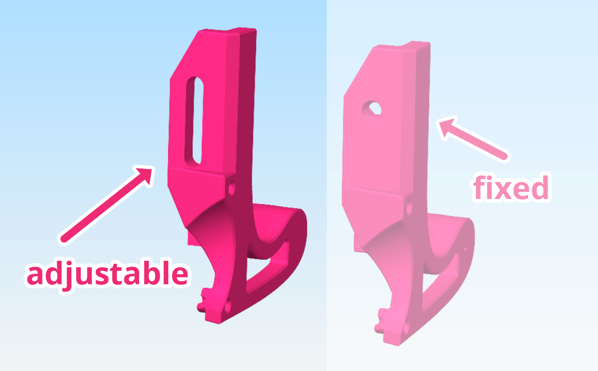
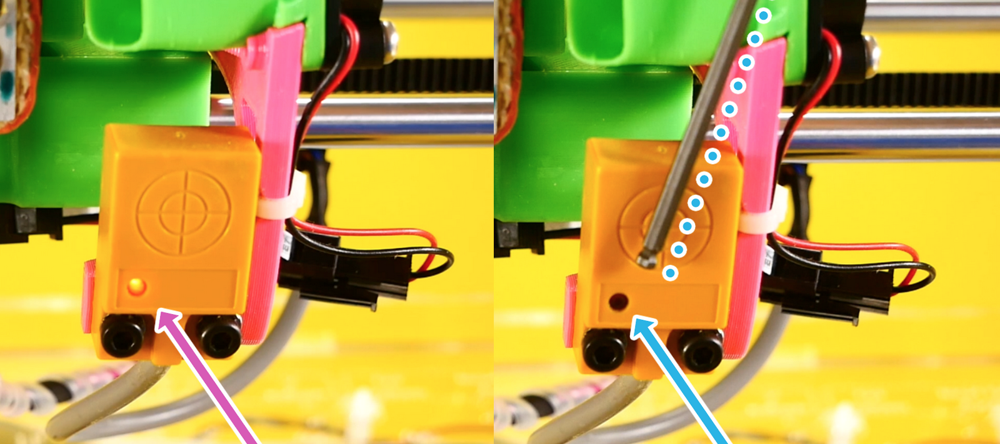

# Position the Adjustable Z Probe

<!-- ---------------------------------------------------------------------------- -->

?> We need to position the Z probe about **1mm (0.04'') above the tip of the nozzle**. This whole section shows you the easiest and best way to do it.

> This guide presumes you use an **adjustable Z probe mount**. Skip this section if your mount is fixed.

<!-- ----------------------------------------------------------------- -->

### What You'll Need
- Tweezers/ Brass wire brush to clean the nozzle
- M3 (2.5mm) hex key
- A piece of office paper (or similar thickness; post-it note, etc.)
- A Z probe spacer
     - It's a 3D printed spacer that ships with the JellyBOX.
     - You can [download and print your own from here.][z-spacer]
     - If you don't have the proper Z probe spacer, you can also use a transparent cable tie. Read more information in the [FAQ](FAQ?id=spacer).
      

[z-spacer]: https://go.imade3d.com/z-probe-spacer

<!-- ---------------------------------------------------------------------------- -->

## Step 1 
Experience the Sensing Distance

Turn on you JellyBOX and move the X axis so that you can see a red light on your Z probe.
 - If your Z probe is yellow, then the light is on the bottom.
 - If your Z probe is green, then the light is on the front.

Try to approach the sensing area with a hex key, tweezers or other piece of metal (_but not_ stainless steel). The red light should **turn off** when the sensor senses the metal.

You'll notice that the light goes off when the metal is about **2mm** (0.08'') from the sensor. This is the sensing distance.

<!-- ---------------------------------------------------------------------------- -->

## Step 2 
Clean the Nozzle

!> Make sure the nozzle is clean before you proceed or you'll be wasting your
time.

1. **Pre-heat the nozzle** to the print temperature (or a bit higher) of the last plastic you printed (e.g., 215 for PLA, 235 for PETG).
2. Wait a bit for the left-over filament to ooze out if there is any.
3. Use tweezers and/or brass wire brush to remove any debris and pieces of old filament from the nozzle.
4. The nozzle can be dirty or discolored, but the tip needs to be clean.
5. Turn off the heat.

<!-- ---------------------------------------------------------------------------- -->

## Step 3
Make the nozzle touch the build plate

Loosen the M3 screw holding the z probe in place so that the probe can move freely.

Move the extruder so that the nozzle is around the center of the build plate.

<!-- ----------------------------------------------------------------- -->

### Item 3.1 
Feel out the nozzle tip with a piece of paper

Turn the z lead screw with your hand until the nozzle is lightly touching the build plate. The easiest way to do this is **by touch**.

Slide a piece of office paper underneath the nozzle and keep moving it back and forth all the while lowering the nozzle. When you can't move the paper freely back-and-forth that's when the nozzle is touching the plate.

<video loop muted autoplay playsinline controls>
<source src="http://www.imade3d.com/awesome-assets/1st_layer_paper_11.mp4" />
Please use a modern browser like Firefox or Chrome to see this helpful video.
</video>

<video loop muted autoplay playsinline controls>
<source src="http://www.imade3d.com/awesome-assets/1st_layer_paper_2.mp4" />
Please use a modern browser like Firefox or Chrome to see this helpful video.
</video>

<!-- ---------------------------------------------------------------------------- -->

## Step 4 
Position the Z probe with the Gap Spacer

Rest the Z probe on top of the _Z Probe Spacer_ and tighten in place.

!> **Moderately tighten.** Many people over-tighten this screw. This is unnecessary, and can lead to loosening connection. By tightening too much, you compromise the structure of the plastic, which will in turn become loose over time.

!> When you're done, there must be about 1mm (0.04'') gap between the tip of the nozzle and the probe.

One millimeter gap guarantees the plate will be sensed by the Z probe before the nozzle hits it.

<!-- ---------------------------------------------------------------------------- -->

## Step 5 
Verify the build plate is within sensing distance

Move the X assembly slightly up and away from the build plate now (rotate the screw with your hand) and watch out for the red light on the Z probe. Did it turn on?

Next, try to lower the X assembly back down and observe the light. When the light turns off, stop.

_The nozzle should be hovering above the build plate._

(If the nozzle is touching the build plate, something went wrong. Scroll up to the top of this page and try the procedure again.)

## Step 6  
Position the Left Filament Cooling Fan

This is a great opportunity to also position the left cooling fan.

Good cooling is essential for quality prints from many materials. For PLA, for example, it's a _must_.

Use the same method you used for the Z probe
1. Loosen up the mount
1. Rest the fan on the Z Probe Spacer (or on a flat zip tie)
1. Tighten the mount again.

> There should be at least 1mm (0.04'') gap between the lowest point of the fan and the tip of the nozzle.

<!-- ---------------------------------------------------------------------------- -->

## Next Steps

⏭️ Congrats! You're now ready to _calibrate your first layer height_!

