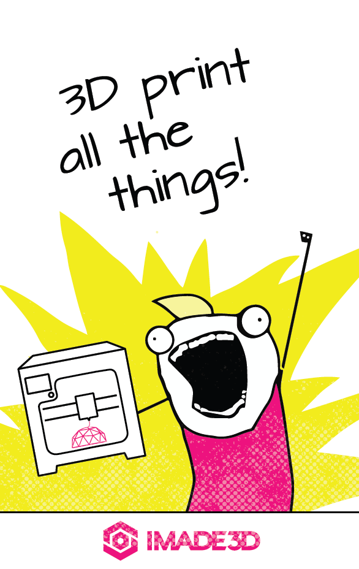

[filename](03-guide-03a.md ':include')

<!-- ---------------------------------------------------------------------------- -->

## Done
It's Calibrated 📐

🎊 _Congrats! You have successfully calibrated your first layer height._ 🎊

- **"I have just finished building my JellyBOX or haven't printed much before."**
  - Bravely proceed to the next section [Your First Print](04-first-print) (and all the subsequent prints)
- **"I've been printing for a while. I just wanted to re-calibrate my first layer."**
  - If you only needed to Calibrate your First Layer Height, you're done. Get back to _3D Printing All the Things_.
  

<!-- ---------------------------------------------------------------------------- -->

