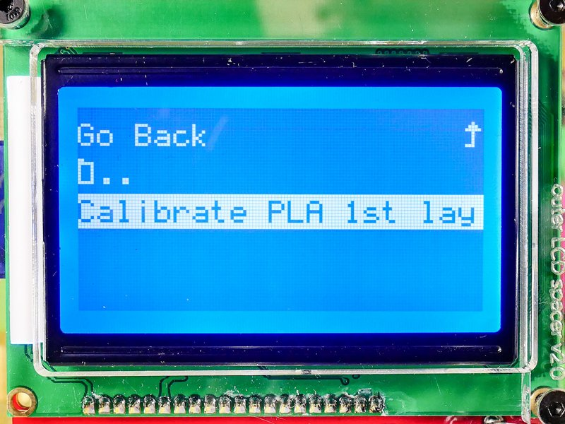
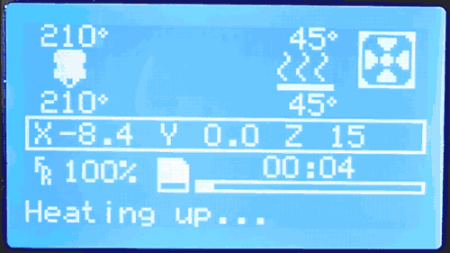
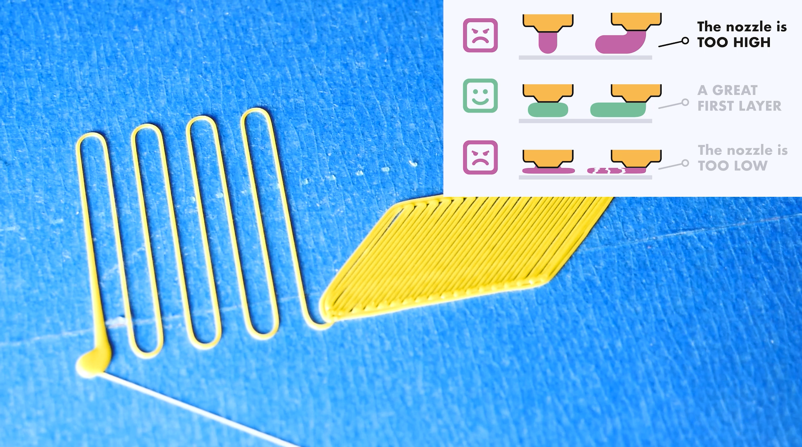
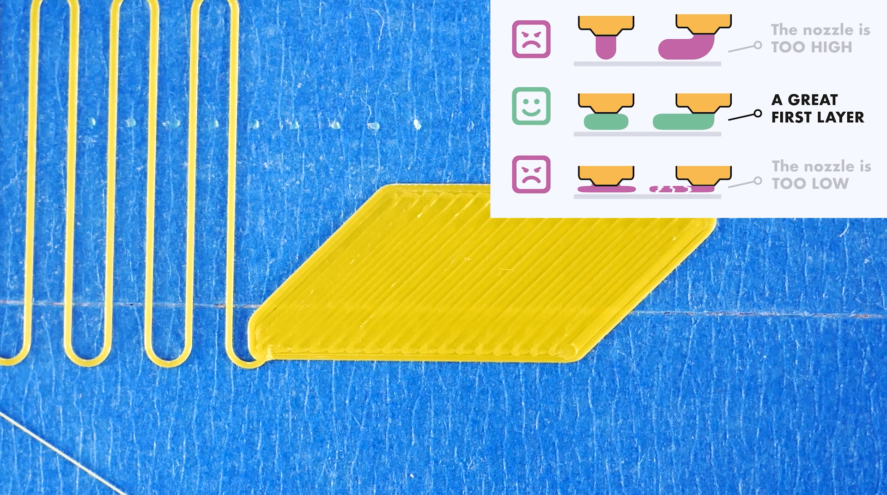
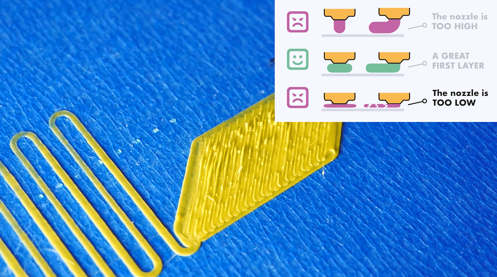

 
_Introductory Item (italics)_

&nbsp;

<!-- ---------------------------------------------------------------------------- -->

## 🎥 Video  

Introduction <small>(4 min with narration)</small>

    <!-- Copy & Pasted from YouTube -->
    <iframe width="560" height="315" src="https://www.youtube-nocookie.com/embed/utCk_CkYjc8?rel=0" frameborder="0" allow="accelerometer; autoplay; encrypted-media; gyroscope; picture-in-picture" allowfullscreen></iframe>

<!-- ---------------------------------------------------------------------------- -->

## Step 1 :id=perfect_1st
This is a description of Step 1 with two items; 

<!-- ----------------------------------------------------------------- -->

### &nbsp; - &nbsp; Item 1.1 <small>(HD3)</small> 
This is the 1st Item describing Step 1 with a warning, a helpful tip revealing three options, and an image; 

!> Warning

?> Helpful Tip

  

    
  

      

       😡 If **too high**, ...     
       🤗 If **just right**, ...   
       😡 If **too low**, ...      
      
  

- This item's image is named: <small> APP-0101-01_Step01-Item01-Image01.jpg</small>
  

<!-- ----------------------------------------------------------------- -->

### &nbsp; - &nbsp; Item 1.2 <small>(HD3)</small> 
This is the 2nd Item describing Step 1 with an image; 
- This item's image is named: <small> APP-0102-01_Step01-Item02-Image01.jpg</small>
  

<!-- ---------------------------------------------------------------------------- -->

## Step 2 
This is a description of Step 2 with two hidden videos; 

  

  First Video
  

  <video loop muted autoplay playsinline controls>
    <source src="http://www.imade3d.com/awesome-assets/load_filament_2.mp4" />
    Please use a modern browser like Firefox or Chrome to see this helpful video.
  </video>

Insert some PLA filament with a sharpened tip and lock the feeder. (PLA is the filament that came with your JellyBOX.)

  

  Second Video
  

  <video loop muted autoplay playsinline controls>
    <source src="http://www.imade3d.com/awesome-assets/load_filament_1.mp4" />
    Please use a modern browser like Firefox or Chrome to see this helpful video.
  </video>

  

?> **Bold Tip:** In a paragraph. 
The quick brown fox jumped over the lazy dog.
The quick brown fox jumped over the lazy dog.
The quick brown fox jumped over the lazy dog.
The quick brown fox jumped over the lazy dog.

<!-- ---------------------------------------------------------------------------- -->

## Step 3 
This is a description of Step 3 with two links, a code snippet and a comment. 

This is a code snippet `Calibrate PLA 1st Layer Print` surrounded by backticks (`).

Some links:
- [⬇️ Download the latest Calibrate PLA 1st Layer Print.][download_02]
- [⬇️ Or download the whole latest SD card][download_02] (includes the print)

These links reference named links in the markdown file: [download_01] and [download_02]

[download_01]: https://raw.githubusercontent.com/IMADE3D/JellyBOX-Essentials/master/GCODES%20-%20ready%20to%20print/1-Your%20First%20Print/PLA/First%20PLA%20print%20-%20210x45.gcode

[download_02]: go.imade3d.com/sd-card

[//]: # ( #TODO put the latest calibration script to ftp and re-link. check start gcode.)

<!-- ----------------------------------------------------------------- -->

### &nbsp; - &nbsp; Item 3.1 

1. Use the LCD rotary encoder to launch the Calibration Print (`Print from SD > JellyBOX-Essentials > SCRIPTS - gcode scripts > PLA`).
   - Insert the SD card
   - Scroll all the way down (clockwise) to find `Print from SD`
   - Navigate the folder structure to find the PLA Calibration Print.

   

2. The JellyBOX will run the bed leveling sequence and save the bed leveling data to memory.
3. The JellyBOX will pre-heat to printing temperature.
4. The JellyBOX will will BEEP.

> 🔔 **The JellyBOX will will BEEP when it's ready for you to initiate the next step.**

<!-- ---------------------------------------------------------------------------- -->

## Step 4

Once you hear the beep, click the lcd controller once to initiate the actual print.

<!-- ----------------------------------------------------------------- -->

### &nbsp; - &nbsp; Item 4.1 
Use the controller to lower the nozzle

Rotate the LCD knob while the JellyBOX is printing.
- Counter-clockwise is down and clockwise is up
- There's a small delay (up to 0.8s) between your rotating and the change in height. We recommend to initially try about 360° rotation and see what happens.
- Note that the adjustment steps are very small - fractions of a millimeter. One whole 360° rotation of the knob gives you only about 0.2mm (0.008'') of Z adjustment.

I don't think the live adjustment is working. How do I test it?

It's best to verify that the live adjusting works by **touch** as the individual movements are too small to see by a naked eye.

1. Start the SD print as outlined above.*
   - _* If you're using firmware version jb-marlin-3.x and higher, you do not have to start a print, which has the advantage of less noise._
1. Then, lightly hold the Z rod with one hand while you rotate the LCD knob up and down.
   - You should feel tiny pulses in the rod associated with very small movements.

[//]: # ( #TODO add an image with round arrows - and also new version with the nozzle showing. Maybe re-edit the video???)

Parallel lines should be all well connected with no visible gaps.

If you forgot, review the [Perfect 1st Layer Height][#perfect_1st] section for details.

 🔁 Repeat as needed. You may need to run the script multiple times until you reach the perfect first layer.

<!-- ---------------------------------------------------------------------------- -->

## Step 5 
Save the Calibration Settings; Only for firmware jb-marlin-3.X and newer

!> If you run jb-marlin-3.X, you need to save the settings, or your  calibration will be lost when the JellyBOX is turned off.
!> Make sure the nozzle is clean before you proceed or you'll be wasting your
time.

`Configuration > Save Settings`

To Save or Not To Save?

Older versions of JellyBOX firmware up to JB-Marlin-2.X save the 1st layer calibration values automatically.

This has slight negative impact on the permanent memory lifespan, but, more importantly, it's uncommon.

Most RepRap style 3D printers require explicit saving - this way the Live Adjustment can be used for impromptu tweaks in the spur of the moment without affecting the printer settings.

<!-- ---------------------------------------------------------------------------- -->

