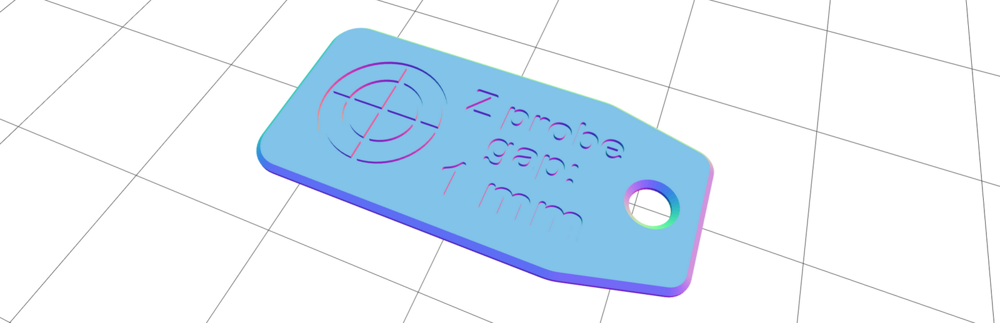

## Question 1
I don't have any printed Z probe spacer and I lost all my cable ties. Can I use something else as a Z probe spacer? :id=spacer

- Answer 1, You can use any sheet-like material that is 1mm thick 👍 (0.04'')
If you have any functional 3D printer, you can also print your own. It takes just a few minutes.

  [https://go.imade3d.com/z-probe-spacer](https://go.imade3d.com/z-probe-spacer)

## Question 2
I don't think the live adjustment is working. How do I test it?

- Answer 2, It's best to verify that the live adjusting works by **touch** as the individual movements are too small to see by a naked eye.

1. Start the SD print [as outlined in Launch The (Calibration) Print](03-calibrate-first-layer?id=step-2-launch-the-calibration-print).*
   - _* If you're using firmware version jb-marlin-3.x and higher, you do not have to start a print, which has the advantage of less noise._
2. Then, lightly hold the Z rod with one hand while you rotate the LCD knob up and down.
   - You should feel tiny pulses in the rod associated with very small movements.

## Question 3
It's bothersome to get into the Live Adjustment mode. Is there a shortcut with a surpriginly groovy connection to Cardiopulmonary Resuscitation (CPR)?

Answer 3, You bet. From the status screen, you can **click twice to go directly into the Live Z Adjustment mode**. This works both while printing and in rest.

The timing of the click is important. This is to limit accidental launches. You will need to learn the timing.

The speed is about the same as the the song `Another One Bites the Dust by Queen` or `Staying Alive by Bee Gees` (~110bmp). Get your groove on 🎶, and just try it a few times 🕺.

<iframe width="auto" height="200" src="https://www.youtube-nocookie.com/embed/rY0WxgSXdEE" frameborder="0" allow="accelerometer; autoplay; encrypted-media; gyroscope; picture-in-picture" allowfullscreen></iframe>

<iframe width="auto" height="200" src="https://www.youtube-nocookie.com/embed/I_izvAbhExY" frameborder="0" allow="accelerometer; autoplay; encrypted-media; gyroscope; picture-in-picture" allowfullscreen></iframe>

!> Ah, ha, ha, ha, stayin' alive, stayin' alive. Ah, ha, ha, ha, stayin' alive.

Oh, and did you know these songs also have the perfect timing to perform CPR and **save someone's life** in the event of a heart attact? This is not a joke. Seriously, it is a part of the [recommended CPR technique as of 2019.](https://www.heart.org/en/health-topics/cardiac-arrest/cardiac-arrest-toolfr-resources/helping-people-stay-alive-ifreasy-with-handsonly-cpr)

<iframe width="auto" height="200" src="https://www.youtube-nocookie.com/embed/n5hP4DIBCEE?start=69" frameborder="0" allow="accelerometer; autoplay; encrypted-media; gyroscope; picture-in-picture" allowfullscreen></iframe>

## Question 4
Where can I get 3D Models for Printing?

Answer 4, To get started, check out the verified printable things on [MyMiniFactory](https://www.myminifactory.com/pages/explore), browse the [popular things on Thingiverse](https://www.thingiverse.com/explore/popular), or roam the free world of [YouMagine](https://www.youmagine.com/designs/popular).

[There are tons of other sources...](https://duckduckgo.com/?q=where+to+find+3d+models+for+printing&t=h_&ia=web)

