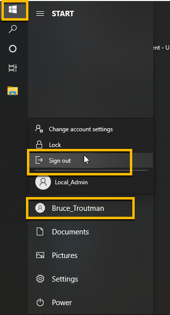
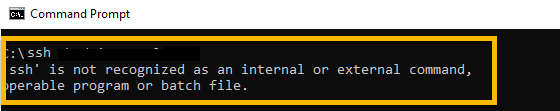
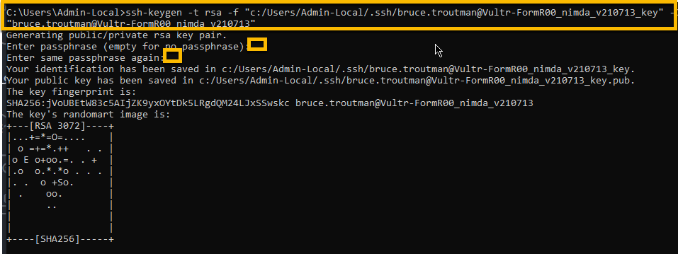

<!-- ------------------------------------------------------------------------- -->

<div class="page-back">

[BACK - FormR Introduction](/fr0001_FormR-Introduction.md)
</div><div class="page-next">

[Create  Node App - NEXT](/Setup/fr0102_Test-Node-Apps.md)
</div><div style="margin-top:35px">&nbsp;</div>

<!-- ------------------------------------------------------------------------- -->


## 1.1 Setup Workstation (<150 mins) #### [Purpose and Background](../Setup/purposes/pfr0101_Setup-Developer-Workstation.md)

#### Introduction
The following steps create the development environment on your workstation for developing an MERN stack (MYSql, Express, React and Node) application. You will access a repository on github and modify it, run it and push changes back to github. We will be using an empty 'Windows Pro N' VM in these instructions. You should be able to use any workstation. Just follow the steps. The total disk space required is 7 GB.

#### Important Note about names and capitalization

- In this tutorial please be careful to use the exact spelling and capitalization. You will be using Windows, Unix and GitBash command prompts. Improper captialization will cause commands to fail. Some examples are: Local_Admin, myProject, repos, remotes and .ssh.

----
### 1. Create a new user, Local_Admin on your workstation. (<10 min)
----
- This account will be used througout the documentation. 

- IMPORTANT--If you use another account, it cannot contain spaces in the name. This tutorial will fail, if spaces are found in the Windows user account name.

1. Login to your Windows account


2. Search for Control Panel


3. Click User Accounts


4. Click Change Account Type


5. Click Add New User...


6. Click the (+) Add someone else...


7. Click I don't have this person's...


8. Click Add a user without...


9. Create a user by filling in the information for:

```
 User name = Local_Admin

 password = FormR!1234
```


10. Go to Control Panel -> User Accounts -> Change Account Type and select the Local_Admin account


11. Click Change Account Type


12. Click Administrator radio button and then the Change Account Type button


13. Sign out

- Click the Start charm on the taskbar
- then click your login name 
- then click Sign out



14. Sign in as Local_Admin


----
### 2. Install any updates to your workstation. (<5 mins)
----


----
### 3. Create 3 folders, change View Options,  Setup ssh and Create keys (<15 mins)
----
1. In C:\ add repos and remotes 

```
 'repos' (local copies of your gitHub repositories files)
 'remotes' (local copies of remote server files)
```


2. In C:\users\Local_Admin\ add .ssh 

```
 '.ssh' (holds your ssh keys related files)
```


3. Change View Options in File Explorer

```
Enable Extentions and Hidden Files
```


4. Test if OpenSSH client is installed.

```
From DOS command prompt run ssh.
```

5.  If OpenSSH client is Not installed



- Install OpenSSH in Apps & Features - Optional Features


6. OpenSSH client


7. Create 3 ssh keys. These keys will be used for GitHub, your Cloud Provider and your Remote server. Run from the Windows command prompt

```
Format:

ssh-keygen -t rsa -f
"<local user folder>/.ssh/
<key owner name>@<host name>_<host user handle>_v<date>_key"
-C "<key owner name>@<host name>_<host user handle>_v<date>"

Example: 

ssh-keygen -t rsa -f "c:/Users/Local_Admin/.ssh/mickey.mouse@github_mick_v210713_key" -C "mickey.mouse@github_mick_v210713"

```

```
In the following change the following to your info:

- "mickey.mouse" to <your Key Owner Name> 
- "mick" to your <Host User Handle> i.e. kff or cbt or bill, etc.
- "v210713" to the <current date>
```

8. Key pairs for Github:

```
ssh-keygen -t rsa -f "c:/Users/Local_Admin/.ssh/mickey.mouse@github_mick_v210713_key" -C "mickey.mouse@github_mick_v210713"
```


9. Key pairs for Cloud Provider:

```
ssh-keygen -t rsa -f "c:/Users/Local_Admin/.ssh/mickey.mouse@Vultr_mick_v210713_key" -C "mickey.mouse@Vultr_mick_v210713"
```


10. Key pairs for access to Remote Server on Cloud Provider:

```
Change "Vultr-FormR00_nimda" below to your VM Instance name and login

ssh-keygen -t rsa -f "c:/Users/Local_Admin/.ssh/mickey.mouse@Vultr-FormR00_nimda_v210713_key" -C "mickey.mouse@Vultr-FormR00_nimda_v210713"
```



11. View created key files:


----
### 4. Install or open Chrome browser (<10 mins)
----
1. Download and install Chrome from:

- Make Chrome your default browser -- Remember this is for the Local_Admin account

```
https://google.com/chrome
```

2. Install Chrome Extensions

```
https://chrome.google.com/webstore/category/extensions?hl=en-US
```


3. Add Markdown Preview Plus


4. Allow access to file URLs

```
chrome://extensions/?id=febilkbfcbhebfnokafefeacimjdckgl
```


5. Add React Developers Tools

```
https://chrome.google.com/webstore/category/extensions?hl=en-US
```


6. Check the installations

```
chrome://extensions/
```


----
### 5. Create an account or sign into GitHub then Add your ssh key. (<15 mins)
----
1. Sign in to GitHub. (Create an account, if you don't have one.)

```
https://github.com
```


2. Add your Github ssh key from your .ssh folder to your github account.

```
https://github.com/settings/ssh
```

3. Click New SSH Key button


4. In notepad open your github public key from your .ssh folder, then copy the contents to the clipboard.


 


5. Paste the clipboard contents into the Key box in the github SSH Keys/ Add someone elseow.

6. Copy the last part of the key and paste it into the Title box.

7. Click the Add SSH key button when finished.


8. Create a new repository: 'myProject'.

```
https://github.com/new
```

9. Add Repository Name "myProject", select Private and check ReadMe file, then click Create Repository.


10. Edit the Readme.md file

```
Click the pencil
```


11. Change file to:

```
# myProject was created on mm/dd/yyyy.
```


12. Commit changes

```
    - Go to the bottom of the edit page to the Commit Changes section.

    - A description is required: Update README.md

    - Click commit Changes
```


    - Close your browser.

13. Configure ssh Access to Github on your Windows workstation

- Create a Host for github connection in the .ssh/config file.

```
Create .ssh/config file in C:/users/Local_Admin/.ssh. Make sure it is saved without the .txt extention, then open with notepad and add the following:

Be sure to change the following:
- "github-mick"  to "github-<your initials>"
- IdentityFile to the name of your github key file in C:/Users/Local_Admin/.ssh

Host github-mick
    HostName       github.com
    IdentityFile   C:/Users/Local_Admin/.ssh/mickey.mouse@github_mick_v210713_key
    User           git
```


14. From the DOS command window, test the connection to github.

```
ssh github-mick  e.g. replace mick with your initials

Note: On the first try when prompted enter "yes" 
```

 

- Change directory to repos, connect again and you will be successfully authenticated.

```
ssh github-mick  e.g. replace mick with your initials
```


----
### 6. Download Git, if not already installed (<10 mins)
----

```
 https://git-scm.com/download/win
```


1. Allow changes

 

2. Select all the default values and install


3. Finish Install check Launch Git Bash


4. Open Git Bash


5. From Git Bash prompt add Username for github

```
Change Mickey Mouse to <your name>:

git config --global user.name = "Mickey Mouse"  i.e. <your name>
```


6. Add User Email for github

```
Change mickey.mouse@gmail.com to <your email in github>:    

git config --global user.email = "mickey.mouse@gmail.com"
```


7. Add git to System path: 

- Enter env from Windows search charm, then click Edit the System Environment Variables


- Click Environment Variables on System Properties window


-In the System (not user) Variables section click Path and then the Edit button


- Click the New button, then add:

```
C:\Program Files\Git\bin
```


- Then click the OK button and close the next 2 windows

- Close the git bash window

----
### 7. Open or Install VSCode  (<10 mins)
----

```
https://code.visualstudio.com/download
```


1. Accept all the defaults


2. Pin it to Task Bar


3. Open VSCode and Install Extensions


4. GitLens  -- Supercharged


5. Prettier


6. React Snippets


7. Change default terminal and add Autosave

        - Using File Explorer create or edit settings.json: 

```
 C:\Users\Local_Admin\AppData\Roaming\Code\User\settings.json
```

        - Delete all lines and Add these lines:

```
{
    "files.autoSave": "afterDelay",

    "terminal.integrated.profiles.windows": {
        "Git-Bash": {
        "path": "C:\\Program Files\\Git\\bin\\bash.exe",
        "args": ["-l"]
        }    
    },

    "terminal.integrated.defaultProfile.windows": "Git-Bash",

    "files.associations": {
        "*.njs": "javascript"
    }
}
```
 


8. From VSCode open a new Terminal


9. Close VSCode

----
### 8. Clone myProject  (<5 mins)
----
1. Using File Explorer open git bash in c/repos folder

```
Navigate to repos, right click and Open Git Bash here
```


2. Clone myProject from github into the local repos folder

```
Change:
    github-mick to github-<your handle> that you created above
    mickeymouse-gmail to <your github account name>

git clone github-mick:mickeymouse-gmail/myProject.git
```


3. Open myProject in VScode

```
cd myProject

code .

-- Remember captialization counts
```


4. Trust the authors


5. Close the VSCode Welcome window


6. Click File.. then Save Workspace as: myProject.code-workspace


----
### 9. Markdown Preview test (<5 mins)
----
1.  Open MyProject in VSCode and click on the ReadMe.md file and add these lines:

```
    1. My first update was changed locally.

    2. I previewed it in VSCode and Chrome.
```


2. Click View.. Command Palette and type: >Markdown: Open Preview to the Side, your preview will display.


3. From File Explorer right click on Readme.md then Open With and navigate to Chrome.exe, your preview will display.


----
### 10. From VSCode push and pull with GitHub (<10 mins)
----
1. From VSCode.. Click the Control Source icon with the number of changes. In this case there are 2 files that have been changed.


2. In the Message textbox, type: 

```
Added Workspace and Updated Readme.md
```


3. If this shows then, Select Always at the There are no staged changes... box 

 

4. Click on the Commit checkmark above the Message textbox


5. If this shows then, Select Yes at the Git fetch box


6. From the Source Control menu, click the three dots (...) More menu, and click Push.


7. Login to GitHub and select the myProject repository then click Readme.md, it should be updated.


8. Modify Readme.md in Github by adding these lines:
(Remember the pencil!)

```
3. I updated it in GitHub.

4. I pulled it to my local repo using VScode
```


9. Commit changes

```
- Go to the bottom of the edit page to the Commit Changes section.

- A description is required: Update README.md added 3. and 4.

- Click commit Changes
```


10. In VSCode, From the Source Control menu, click the three dots (...) More menu, and click Pull.


11. The Github changes will now appear in the Readme.md file. 


----
### 11. Install Node for Windows (<5 mins)
----
1. Be sure to CLOSE VSCode before installing Node

2. To download browse to: 

```
nodejs.org/en/
```

3. Select the version that is Recommended for Most Users


4. Download and install using all the defaults.


5. Allow changes


6. Finish


7. Test from Windows command prompt:

```
    node --version
    npm --version
```


----
### 12. Install MySql for windows (< 45 mins)
----
1. Browse to: 

```
dev.mysql.com/downloads

then click: MySql Installer for Windows
```


2. Choose the version: 

```
mysql-installer-community-x.x.xx.x.msi  (Do not choose the web version.)
```


3. Select No, thanks, just start my download


4. Choose Setup Type: Custom


5. Select Products 

    - MySQL Server
    - MySQL Workbench
    - MySQL Shell
    - Connector/ODBC
    - Connector/J
    - MySQL Documentation
    - Samples and Examples

6. Select from the "Available Products" column, then click the Top arrow to move it to the left column.


7. Product Configuration


- Use the password: FormR!1234


```
#### !! Remember to write your passwords in a safe place !!
```


8. Connect to Server

```
Enter this password -> FormR!1234 and click the Check button

#### !! Remember to write your passwords in a safe place !!
```


9. Windows Service


10. Apply Configuration


11. Be sure to Click the check boxes for Starting Workbench and Shell in the Installation Complete windows


12. MySQL Shell and MySQL WorkBench are automatically opened because you clicked the check boxes in the previous step.


13. Select the Workbench window and click Local Instance 


14. Enter credentials


15. Use mMySQL Workbench to Create and Grant Privileges to user account: nimdas with host %
(Note: root@localhost has all rights and nimdas@% will have all rights) 

- Open New Query tab


- Paste the following

```
CREATE USER 'nimdas'@'%' IDENTIFIED WITH mysql_native_password BY 'FormR!1234';
GRANT ALL PRIVILEGES ON *.* TO 'nimdas'@'%';
SELECT user,authentication_string,plugin,host FROM mysql.user;
```


- Click the execute icon


16. Select the MySql Shell window

```
Enter:  \connect root@localhost

Enter: FormR!1234

Enter: Y to save password

```


17. Shell SHOW DATABASES

```
Enter: \sql SHOW DATABASES;  ( Don't forget the \ and ; )
```


----
### 13. Install BitVise ssh client (<5 mins)
----
1. Install Bitvise from: 

```
https://bitvise.com/ssh-client-download
```


----
### 14. Install TextPad (<5 mins)
----
1. Install Textpad from: 

```
https://textpad.com/download
```

2. Select the latest version then accept the defaults


----
### Congratulations! Your Developer Workstation is setup.

 After all installations on a new Windows 10 machine, 7 GB was added to Drive C:.

----
<!-- ------------------------------------------------------------------------- -->

<div class="page-back">

[BACK - FormR Introduction](/fr0001_FormR-Introduction.md)
</div><div class="page-next">

[Create a Simple Node App - NEXT](/Setup/fr0102_Test-Node-Apps.md)
</div>

<!-- ------------------------------------------------------------------------- -->
