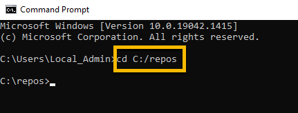
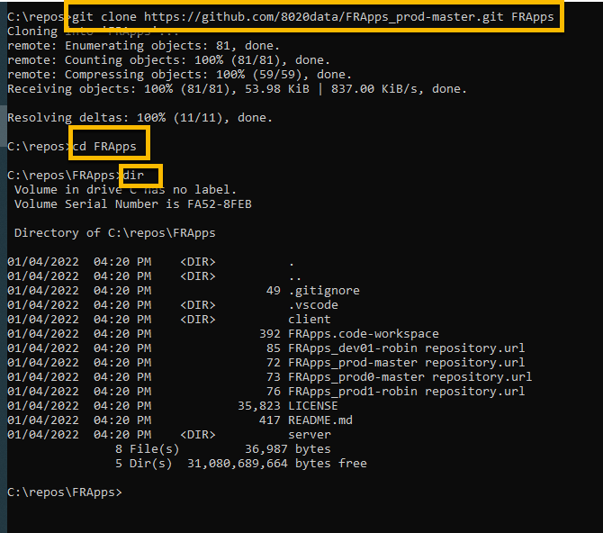
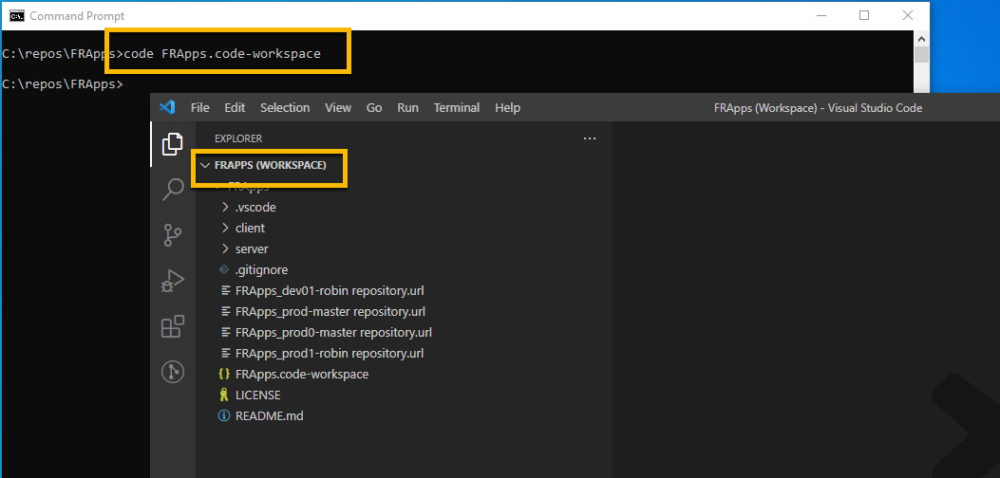
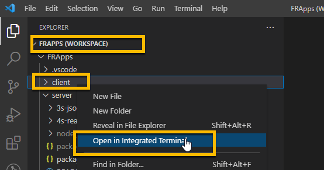

<!-- ------------------------------------------------------------------------- -->

<div class="page-back">

[BACK - Test Node](/Setup/fr0102_Test-Node.md)
</div><div class="page-next">

[Clone FRApps - NEXT](/Setup/fr0103_Clone-FRApps.md)
</div><div style="margin-top:35px">&nbsp;</div>
 
<!-- ------------------------------------------------------------------------- -->

## 1.3 First React Apps 
#### [Purpose and Background](../Setup/purposes/pfr0102_First-React-Apps.md)

#### Introduction  (*This section is not complete*) Needs finalized FRApps_prod-master


#### Important note about names, capitalization and pictures
- In this tutorial please be careful to use the Exact Spelling and Capitalization. You will be using Windows, Unix and GitBash command prompts. Improper captialization will cause commands to fail. Some examples are: Local_Admin, myProject, repos, remotes and .ssh.
- This documentation was produced during 2021. You will experience differences in some of the pictures due to the changes made over time by the developers of the softwares and web sites that are used.


----


### 1 Clone FRApps_prod_master (<5 min)
----
1. Clone into the local repos folder using the Windows Command prompt

```
cd C:\repos\
```
 


 
```
git clone https://github.com/8020data/FRApps_prod-master.git FRApps

cd FRApps

dir
```



2. Open with VSCode

```
code FRApps.code-workspace
```

- If prompted, click "Yes I trust the authors".


 



client npm install npm audit npm audit fix --force

server npm install npm audit npm audit fix --force


1. Empty
2. React Button
3. React noAPI
4. React with API

<!-- ------------------------------------------------------------------------- -->

<div class="page-back">

[BACK - Test Node](/Setup/fr0102_Test-Node.md)
</div><div class="page-next">

[Clone FRApps - NEXT](/Setup/fr0103_Clone-FRApps.md)
</div>
<!-- ------------------------------------------------------------------------- -->
