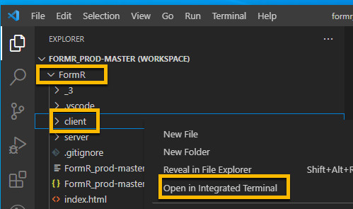
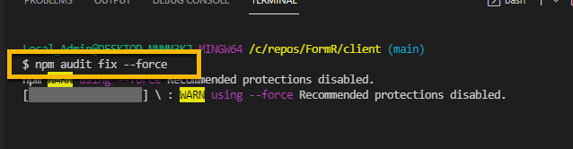

<!-- ------------------------------------------------------------------------- -->

<div class="page-back">

[BACK - Test Node](/Setup/fr0102_Test-Node.md)
</div><div class="page-next">

[Clone FRApps - NEXT](/Setup/fr0103_Clone-FRApps.md)
</div><div style="margin-top:35px">&nbsp;</div>
 
<!-- ------------------------------------------------------------------------- -->

## 1.3 Clone First React Apps 0:30
#### [Purpose and Background](../Setup/purposes/pfr0102_First-React-Apps.md)

#### Introduction  
- FormR coding uses React. In this topic you will clone and test 4 basic React applications on your local workstation.


#### Important note about names, capitalization and pictures
- In this tutorial please be careful to use the Exact Spelling and Capitalization. You will be using Windows, Unix and GitBash command prompts. Improper captialization will cause commands to fail. Some examples are: Local_Admin, myProject, repos, remotes and .ssh.
- This documentation was produced during 2021. You will experience differences in some of the pictures due to the changes made over time by the developers of the softwares and web sites that are used.


----


### 1 Clone FRApps Repository 0:05
----
1. Clone into the local repos folder using the Windows Command prompt

```
cd C:\repos\
```
 


 
```
git clone https://github.com/8020data/FRApps_prod-master.git FRApps

cd FRApps

dir
```


2. Open with VSCode

```
code FRApps.code-workspace
```

- If prompted, click "Yes I trust the authors".


 


### 2. Install Node modules  0:10
----
1. Right click on the server folder

2. Click Open in Integrated Terminal, then 



```
npm install
```


3. Fix the vulnerabilities

```
npm audit fix --force
```




4. Right click on the client folder

5. Click Open in Integrated Terminal, then 


```
npm install 
```


6. Fix the vulnerabilities

```
npm audit fix --force
```


1. Empty
2. React Button
3. React noAPI
4. React with API

----
 ### 3. Run Client and Server applications 0:10
----

1. Right click on the server/1s-world folder and
2. Click Open in Integrated Terminal, then 

 

```
npm start
```


3. Right click on the client/1c-world folder and
4. Click Open in Integrated Terminal, then 

(Note: The client application can take up to 15 minutes to start for the first time)


```
npm start
```


----
### 4. Test the applications on your local workstation 0:05
----
1. Enter each of the following in your browser to test the server:

```
    localhost:50251
    localhost:50251/api/world/cities/test
    localhost:50251/api/world/cities/model
    localhost:50251/api/world/cities/
    localhost:50251/api/world/cities/1

    localhost:50251/api/world/countries/test
    localhost:50251/api/world/countries/model
    localhost:50251/api/world/countries/
    localhost:50251/api/world/countries/1
```

2.  Enter the following in your browser to test the client:

```
    localhost:50201
```

----
#### Congratulations! You have Cloned FRApps successfully to your local workstation.
----

<!-- ------------------------------------------------------------------------- -->

<div class="page-back">

[BACK - Test Node](/Setup/fr0102_Test-Node.md)
</div><div class="page-next">

[Clone FRApps - NEXT](/Setup/fr0103_Clone-FRApps.md)
</div>
<!-- ------------------------------------------------------------------------- -->
