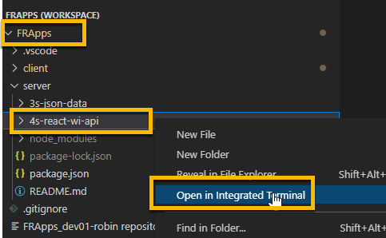
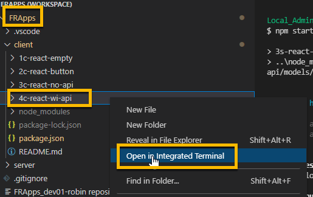

<!-- ------------------------------------------------------------------------- -->

<div class="page-back">

[BACK - Test Node](/Setup/fr0102_Test-Node.md)
</div><div class="page-next">

[Vultr Ubuntu - NEXT](/Setup/fr0301_Setup-Vultr-Ubuntu.md)
</div><div style="margin-top:35px">&nbsp;</div> 
 
<!-- ------------------------------------------------------------------------- -->

## 1.3 Clone First React Apps 0:45
#### [Purpose and Background](../Setup/purposes/pfr0102_First-React-Apps.md)

#### Introduction  
- FRApps coding uses React. In this topic you will clone and test 4 basic React applications on your local workstation.


#### Important note about names, capitalization and pictures
- In this tutorial please be careful to use the Exact Spelling and Capitalization. You will be using Windows, Unix and GitBash command prompts. Improper captialization will cause commands to fail. Some examples are: Local_Admin, myProject, repos, remotes and .ssh.
- This documentation was produced during 2021. You will experience differences in some of the pictures due to the changes made over time by the developers of the softwares and web sites that are used.


----


### 1 Clone FRApps Repository 0:05
----
1. Clone into the local repos folder using the Windows Command prompt

```
cd C:\repos\
```
 


 
```
git clone https://github.com/8020data/FRApps_prod-master.git FRApps

cd FRApps

dir
```


2. Open with VSCode

```
code FRApps.code-workspace
```

- If prompted, click "Yes I trust the authors".


 


----
### 2. Install Node modules  0:15
----
1. Right click on the client folder

2. Click Open in Integrated Terminal, then 


```
npm install
```


3. Fix the vulnerabilities

```
npm audit fix --force
```


4. Right click on the server folder

5. Click Open in Integrated Terminal, then 


```
npm install 
```


----
 ### 3. Run Client 1c-react-empty application 0:05
----

1. Right click on the client/1c-react-empty folder
2. Click Open in Integrated Terminal, then 

 

```
npm start
```


----
 ### 4. Run Client 2c-react-button application 0:05
----

1. Right click on the client/2c-react-button folder
2. Click Open in Integrated Terminal, then 

 

```
npm start
```


- Click the Like button.


----
 ### 5. Run Client 3c-react-no-api application 0:05
----

1. Right click on the client/3c-react-no-api folder
2. Click Open in Integrated Terminal, then 

 

```
npm start
```


3. Click Invoices, then Santa Monica


----
 ### 6a. Run Server 4s-react-wi-api application 0:05
----

1. Right click on the server/4s-react-wi-api folder
2. Click Open in Integrated Terminal, then 

 

```
npm start
```


3. Browse to

```
http://localhost:50114/invoices
```


( Note: Keep this step 6a running when you do step 6b }

----
 ### 6b. Run Client 4c-react-wi-api application 0:05
----

1. Right click on the client/4c-react-wi-api folder
2. Click Open in Integrated Terminal, then 

 

```
npm start
```


3. Click Invoices, then Ocean Avenue


----
#### Congratulations! You have cloned and run the FRApps successfully to your local workstation.
----

<!-- ------------------------------------------------------------------------- -->

<div class="page-back">

[BACK - Test Node](/Setup/fr0106_Test-Node.md)
</div><div class="page-next">


[Vultr Ubuntu - NEXT](/Setup/fr0301_Setup-Vultr-Ubuntu.md)
</div>

<!-- ------------------------------------------------------------------------- -->
