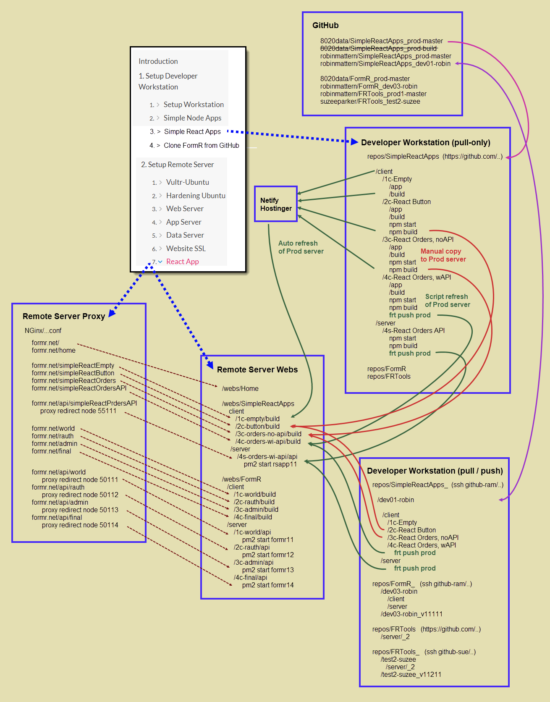

<!-- ------------------------------------------------------------------------- -->

[BACK - Create a Simple Node App](/Setup/fr0102_Simple-Node-Apps.md)

[Clone FormR - NEXT](/Setup/fr0103_Clone-FormR.md)

&nbsp;

 
<!-- ------------------------------------------------------------------------- -->

## 1.3 Simple React Apps 

#### Introduction

1. Empty
2. React Button
3. React noAPI
4. React with API

  . 
### Infrastructure Diagram

<!-- ------------------------------------------------------------------------- -->

[BACK - Create a Simple Node App](/Setup/fr0102_Simple-Node-Apps.md)

[Clone FormR - NEXT](/Setup/fr0103_Clone-FormR.md)

<!-- ------------------------------------------------------------------------- -->
