<!-- ------------------------------------------------------------------------- -->

<div class="page-back">

[BACK - Workstation](/Setup/fr0101_Setup-Developer-Workstation.md)
</div><div class="page-next">

[First  React Apps - NEXT](/Setup/fr0102_First-React-Apps.md)
</div><div style="margin-top:35px">&nbsp;</div>
 
<!-- ------------------------------------------------------------------------- -->

## 1.2 Test Node 
#### [Purpose and Background](../Setup/purposes/pfr0102_Test-Node.md)

#### Introduction
The following steps create several basic node applications. There are script, server, client and MySQL testing applications. Each has special requirements. We will create a folder structure and install the required packages. Everything will be installed in the repos/myProject folder. All activities will be done in VSCode.   

#### Important note about names, capitalization and pictures
- In this tutorial please be careful to use the Exact Spelling and Capitalization. You will be using Windows, Unix and GitBash command prompts. Improper captialization will cause commands to fail. Some examples are: Local_Admin, myProject, repos, remotes and .ssh.
- This documentation was produced during 2021. You will experience differences in some of the pictures due to the changes made over time by the developers of the softwares and web sites that are used.


----
### 1. Test the Node version. (<5 mins)
----
1. In VSCode select the myProject folder and open terminal

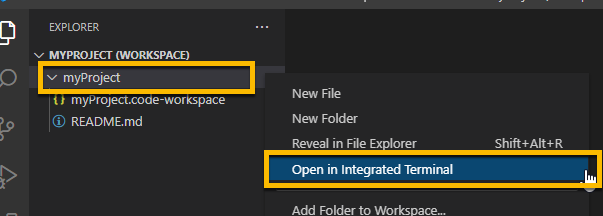

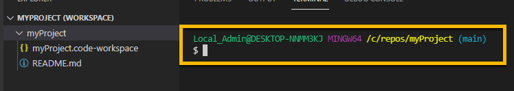

2. From terminal enter:

```
     node --version 
```

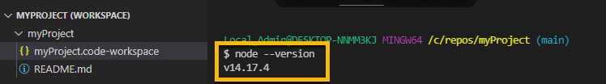

----
### 2. Create sub-folders in myProject (<5 mins)
----
1. Click on myProject and create a new folder:

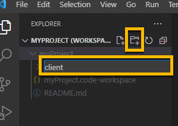

2. Create the following myProject sub-folders:

```
     client
     docs
     scripts
     server
     app01s as sub-folder to the server folder
```

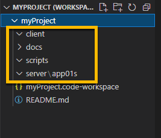

----
### 3. Create a new file, batch.js, in the scripts folder and run it with Nodejs. (<10 mins)
----
1. Click on the scripts folder, then click the new file icon


2. In the blank area enter:

```
batch.js
```

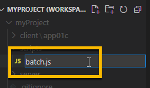

3. Click on batch.js to open it in the editor

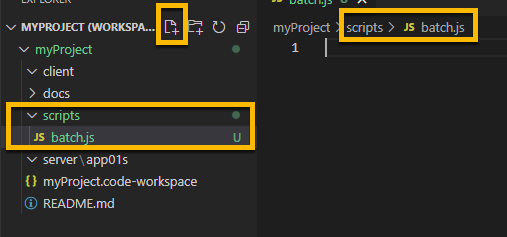

4. Add some code to batch.js:

```
console.log("Hello, World!");
```

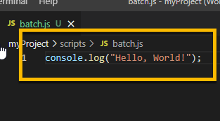

5. Right click on batch.js in the scripts folder and select Open in Integrated Terminal and click in the Terminal window 

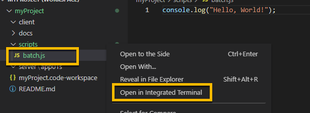

6. In Terminal window enter:

```
node batch.js
```

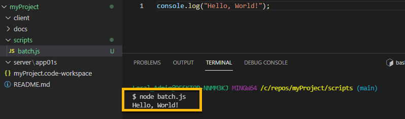


----
### 4. Create a new file, server.js in the server folder and run it with Nodejs. (<10 mins)
----
1. Right click on the server folder and Select Open in Intgrated Terminal and enter:

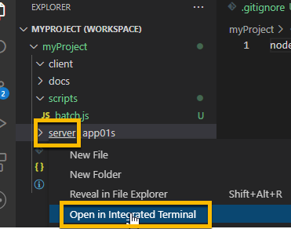

```
npm init

Press enter to accept all defaults
```

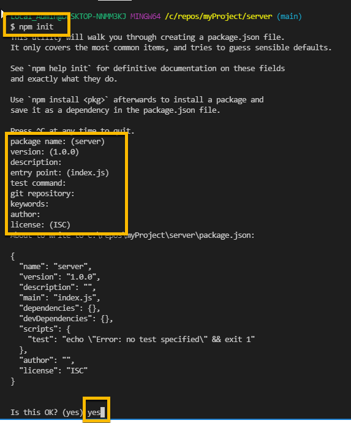

```
npm install express
```

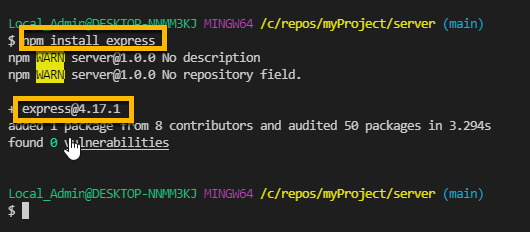 

2. In the previous steps we installed using npm (node package manager) which created and populated a new folder node_modules. This folder can be very large in size but does not need to be tracked in GitHub. Files in .gitignore will not be tracked in GitHub. 

3. Create a new file in the myProject folder, .gitignore and add:

```
node_modules
```

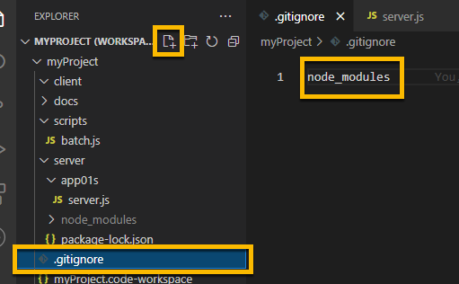

4. Create a new file, server.js in the server/app01s folder and add this code: 

```
const express = require("express")
const app = new express();
app.use('/',myPage)

function myPage(req, res){
    var url = req.originalUrl;
    //send to browser
    res.send(`Hello, World from ${url} !`)
}

// set port
const PORT       =   process.env.PORT || 8080; 
// listen for requests
app.listen( PORT, () => {
    console.log(   `Server is running on port ${PORT}.` );
    } );

```

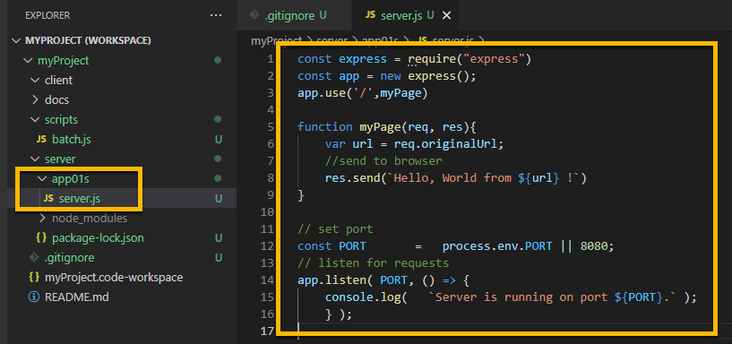

5. Right click on the app01s folder and Select Open in Integrated Terminal and click in the Terminal window

6. Enter:

```
node server.js
```

7. Allow Access in Microsoft Firewall and click Private networks

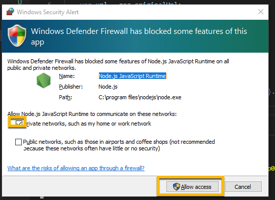


8. Terminal shows server running on port 8080

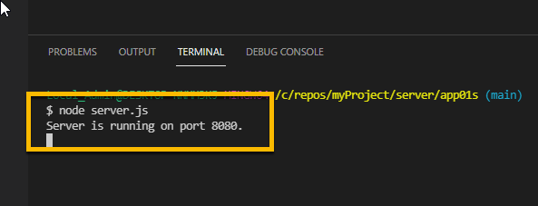

9. Browse to:

```
http://localhost:8080/myProject/server/app01s
```

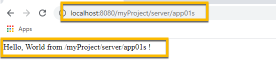


#### Push your changes to GitHub

1. Click the Source Control charm

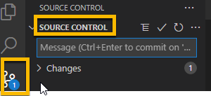

2. Add Message:

```
Add Node App - batch.js
```

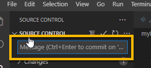

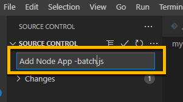

3. Click on Commit checkmark

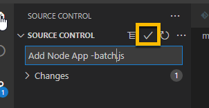

3. Push

```
Click on 3 dots then click Push 
```

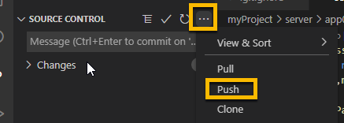

4. The following message may show the first time. 
```
Click on: Ok, Don't show again
```

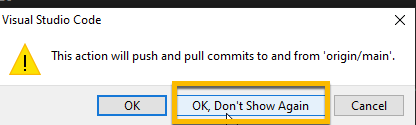

#### *** End of Push to Github

----
### 5. Create a basic react app in the client folder and run it with Nodejs. (<10 mins)
----
1. Right click in the - client - folder and select Open in Integrated Terminal and click in the Terminal window

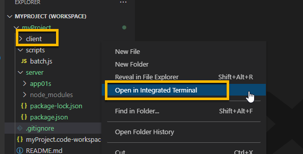

2. Enter:

```
npm init
```

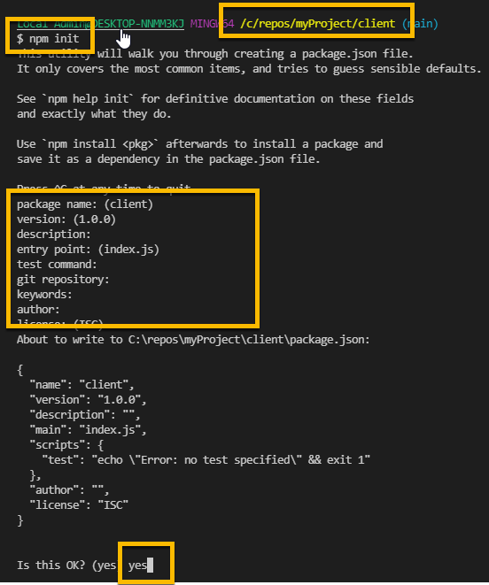

3. Create the react app:

```
npx create-react-app app01c
```

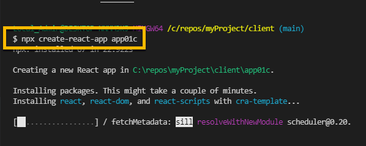

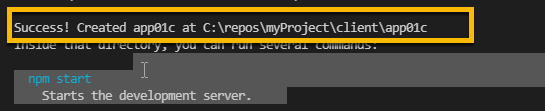

4. Right click in the - client/app01c - folder and select Open in Integrated Terminal and click in the Terminal window

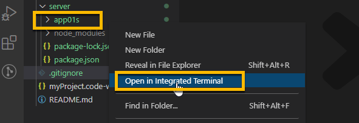

5. Enter: 

```
npm start
``` 

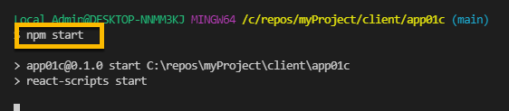

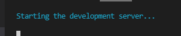

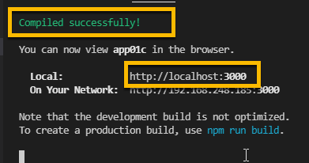

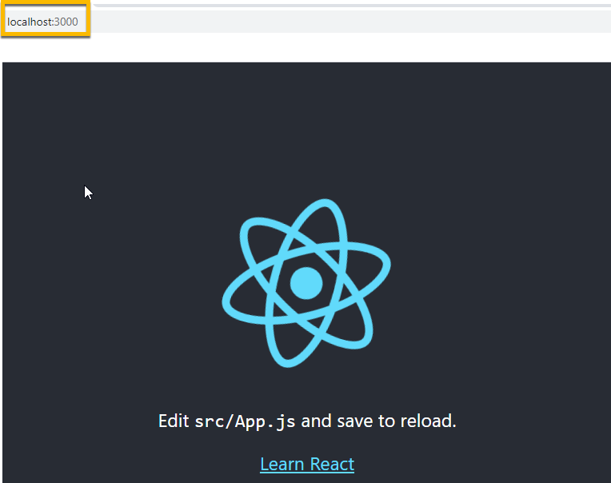

6. Adjust package.json for React-Scripts

- npm audit will return vulnerabilities list for react-scripts

     1. In vscode edit package.json
#### Push your changes to GitHub
     1. Click the Source Control charm
     2. Add description of your choice
     3. Click the checkmark to Commit
     4. Click Push on the Source Control three dots (...) menu

----
### 6. Create a Nodejs routine to access the local MySQL database and return information. (<10 min)
----
1. Install Sequelize. It will be used to connect to and access information in MySQL. 

2. Right click in the - server - folder and select Open in Integrated Terminal and click in the Terminal window

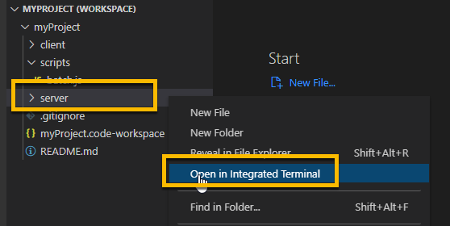

3. Enter:

```
npm install --save sequelize
```

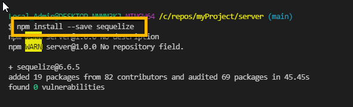

```
npm install --save mysql2
```
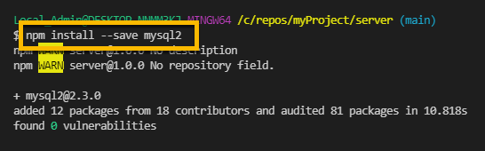

4. Open Mysql Workbench to create a schema (database) called practice.

5. Search for Mysql WorkBench and open it

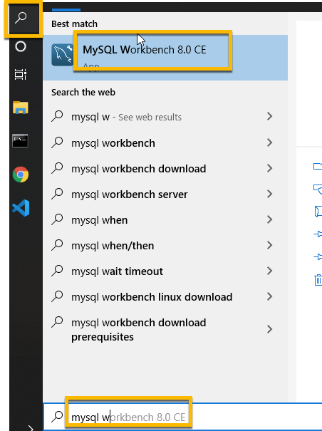

6. Right click on the icon and Pin to TaskBar

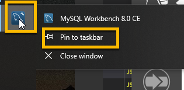

7. In Workbench click on the Local Instance that was created when MySQL was installed

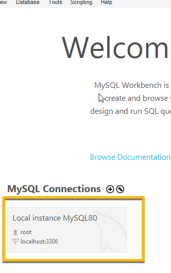

8. In the query 1 window enter:

```
CREATE DATABASE practice
```
9. Then click the execute icon

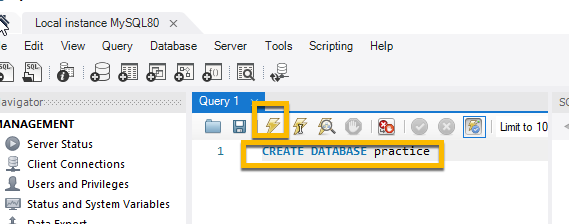

10. Click on the Schemas tab, then the refresh icon and your new database, practice, will appear 

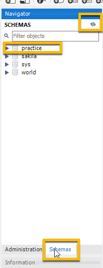

11. From VSCode Explorer navigate to the folder server/app01s and create a new file, queryDB.js, then enter the following code:

```
const Sequelize = require("sequelize");
const sequelize = new Sequelize("practice", "root", "FormR!1234", {
  host: "localhost", 
  dialect: "mysql", 
});
 
// 1. CREATE TABLE 
//const SQLstr = "CREATE TABLE customers (id INT AUTO_INCREMENT PRIMARY KEY, name VARCHAR(255), address VARCHAR(255))"

// 2. SHOW TABLES 
//const SQLstr = "SHOW TABLES"

// 3. INSERT 1 ROW
//const SQLstr = "INSERT INTO customers (name, address) VALUES ('Company Inc', 'Highway 37')"

// 4. UPDATE 1 ROW 
//const SQLstr = "UPDATE customers SET address = 'Highway 40' where id = 1"

// 5. Create a Stored Procedure
//const SQLstr = "CREATE PROCEDURE sp_getcustomers() Select id, name,address from customers ;"

// 6. Execute a Stored Procedure
//const SQLstr = "Call sp_getcustomers"

//------------------------------------------------------------

runQuery();
async function runQuery() {
  try { 
  const values = await sequelize.query(SQLstr);
  console.log(values);
  } catch (error) {
    console.log(error);  
  }
}
```

12. In each step 1 - 6 there is a 'const SQLStr..' line. The symbol // is a comment. For each step, one at a time, remove the comment on  the 'const SQLStr..' line, then go to the terminal and run: node queryDB.js. 

13. After the execution of a step, Comment out the 'const SQLStr..' line for this step and uncomment the line in the next step

14. Repeat for all steps. 

- Be aware, if you execute the same step twice in a row you will get an error. For example, step 1. creates a table. If you run it a second time  You will get an error that tells you that the table already exists.

15. Uncomment Step 1 Create Table

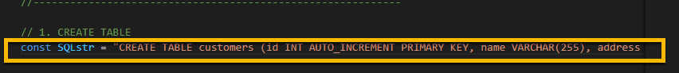

16. Right click in the - server/app01s - folder and select Open in Integrated Terminal and click in the Terminal window

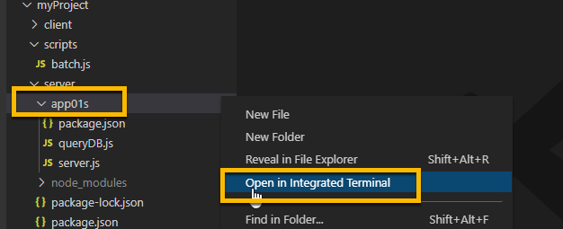

17. Enter:

```
node queryDB
```

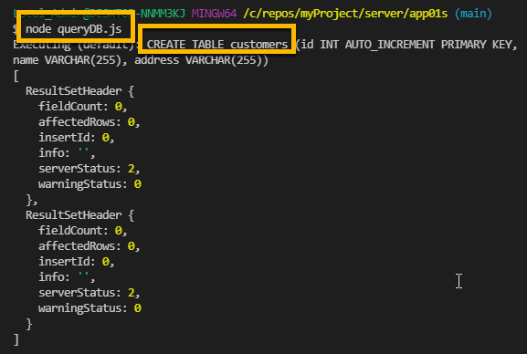

18. Check in Workbench that the customers table was created


19. Comment out "Create Table" and uncomment "Show Tables" then run node queryDB

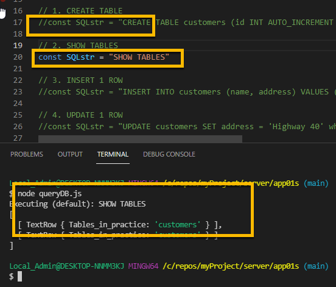

20. Comment out "Show Tables" and uncomment "Insert 1 Row" then run node queryDB

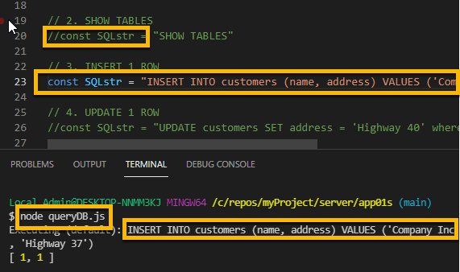

21. Check Workbench - Insert

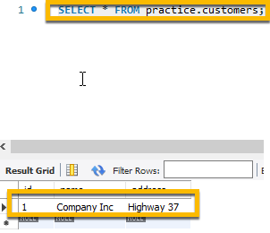

22. Comment out "Insert 1 Row" and uncomment "Update 1 Row" then run node queryDB


23. Check Workbench - Update

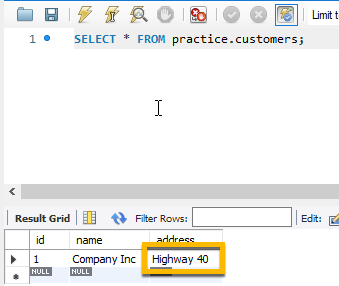

24. Comment out "Update 1 Row" and uncomment "Create Stored Procedure" then run node queryDB

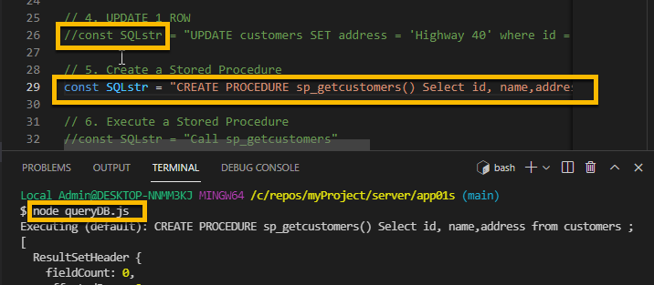

25. Check Workbench - Create Stored Procedure

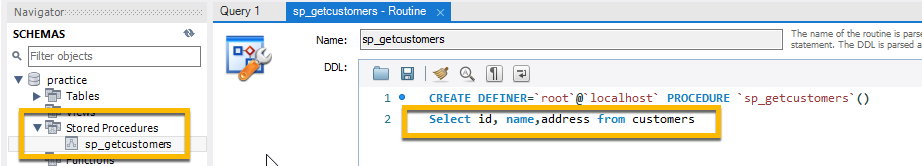

26. Comment out "Create Stored Procedure" and uncomment "Execute Stored Procedure" then run node queryDB


27. Check Workbench - Create Stored Procedure


28. Comment out "Execute Stored Procedure" and go to workbench and Drop Database practice to reset so these routines can be run again.


#### --- Push your changes to Github
     1. Click the Source Control charm
     2. Add description of your choice
     3. Click the checkmark to Commit
     4. Click Push on the Source Control three dots (...) menu
  
----
#### Congratulations! You have run the Node applications that test your development environment.
----

<!-- ------------------------------------------------------------------------- -->

<div class="page-back">

[BACK - Setup Developer Workstation](/Setup/fr0101_Setup-Developer-Workstation.md)
</div><div class="page-next">

[First  React Apps - NEXT](/Setup/fr0102_First-React-Apps.md)
</div>

<!-- ------------------------------------------------------------------------- -->

