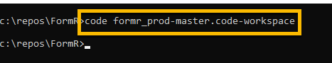
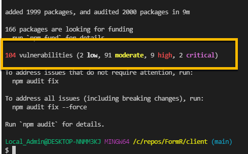

<!-- ------------------------------------------------------------------------- -->

<div class="page-back">

[BACK - Simple Node Apps](/Setup/fr0102_Simple-Node-Apps.md)
</div><div class="page-next">

[Setup Vultr Ubuntu - NEXT](/Setup/fr0301_Setup-Vultr-Ubuntu.md)
</div><div style="margin-top:35px">&nbsp;</div> 

<!-- ------------------------------------------------------------------------- -->

## 1.3 Clone FormR

#### Change strategy

Master is currently on Robin's git repo and local repo as:  test1-master

Update strategy:

```
Robin changes on his local and pushes to his git repo.

Robin merges with his local 8020 test-master

Robin pushes to git 8020 test-master

Bruce/Ken git pulls from 8020 test-master to their local test-master
```

### 1. Cloning FormR repository

- Create in local repos

- Open Windows Command prompt


```
mkdir C:\repos\FormR

cd C:\repos\FormR
```
 

 
```
git clone https://github.com/8020data/FormR_test-master.git test-master

cd test-master

dir
```


- Open with VSCode

```
code formr_test-master.code-workspace
```
 


### 2. Install Node modules

- Right click on the server folder and
- Click Open in Integrated Terminal, then 


```
npm install
```




- Right click on the client folder and
- Click Open in Integrated Terminal, then 


```
npm install 
```


### 3. Install RAuth and World databases in MySQL (Note that the World database has been modified so that all tables contain ID primary key fields)

- Open MySQL Workbench by clicking its icon in your task bar or by searching for Workbench in the Windows search, then

- Click the Local Instance under MySQL Connections


- Run Script file

    - Click on Schemas to show your current databases

    - Click on the Open a script file in this editor


- Navigate to and Open: 

```
 C:\repos\FormR\test-master\_3\SQLs\FormR_RAuth-DB-Create.
 sql

 then repeat these steps for:

 C:\repos\FormR\test-master\_3\SQLs\FormR_World-DB-Create.sql
 
```

 


- Click the Execute icon


- Click the refesh icon above the schema list


- IMPORTANT - Repeat these same steps for the World DB file

```
 C:\repos\FormR\test-master\_3\SQLs\FormR_World-DB-Create.sql
```

### 4. Make sure that your MySQL password for root  is set to:  FormR!1234

- Open MySQL Workbench by clicking its icon in your task bar or by searching for Workbench in the Windows search, then

- Click the Local Instance under MySQL Connections


- Click the File tab, then click 'New Query Tab'

 

- Enter the following into the Query window, then

- Click the Execute icon

```
ALTER USER 'root'@'localhost' IDENTIFIED BY 'FormR!1234';
```


- Close workbench and reopen it, then

- Right click on the Local Instance, then

- Click Edit Connection, then


- Click Store in Vault, then

- Enter the new password: FormR!1234 and click OK


- Click Test Connection then

- Click Close and then close Workbench


 ### 5. Run Client and Server applications

- Right click on the server/1s-world folder and
- Click Open in Integrated Terminal, then 

 

```
npm start
```


- Right click on the client/1c-world folder and
- Click Open in Integrated Terminal, then 

(Note: The client application can take up to 15 minutes to start for the first time)


```
npm start
```


### 6. Test the applications

- Test the server, browse to

```
    localhost:50251
    localhost:50251/api/world/cities/test
    localhost:50251/api/world/cities/model
    localhost:50251/api/world/cities/
    localhost:50251/api/world/cities/1

    localhost:50251/api/world/countries/test
    localhost:50251/api/world/countries/model
    localhost:50251/api/world/countries/
    localhost:50251/api/world/countries/1
```

- Test the client, browse to

```
    localhost:50201
```

issues

1. test create, read, update and delete


<!-- ------------------------------------------------------------------------- -->

<div class="page-back">

[BACK - Simple Node Apps](/Setup/fr0102_Simple-Node-Apps.md)
</div><div class="page-next">

[Setup Vultr Ubuntu - NEXT](/Setup/fr0301_Setup-Vultr-Ubuntu.md)
</div>

