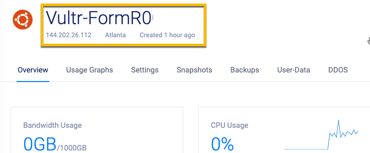
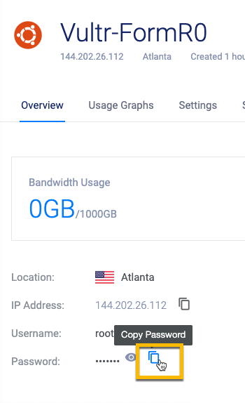

<!-- ------------------------------------------------------------------------- -->

<div class="page-back">

[BACK - Clone FormR  ](/Setup/fr0103_Clone-FormR.md)
</div><div class="page-next">

[Harden Ubuntu - NEXT](/Setup/fr0302_Setup-Hardening-Ubuntu.md)
</div>

<!-- ------------------------------------------------------------------------- -->

## Instructions for creating an Ubuntu server on Vultr

- In order to test our FormR apps on the Internet
 we will create an Ubuntu server on the cloud provider, Vultr.com. Vultr costs only $5 per month. 

### 1. Create New Ubuntu Instance
- Signin or create an account on vultr.com

- Deploy New Server 


- Choose Server: Cloud Compute


- Server Location


- Server Type: Ubuntu 18.04 x64 (We use this version for the FormR tutorial)


- Server Size: 25GB SSD


- Add SSH Key
    - Select your Vultr public key in C:\users\Local_Admin\\.ssh


    - Open the file in Notepad and copy the key 


    - Paste the key value into the Vultr SSH Key box and give the key a name.


- Server Host Name and Label: FormRx-Vultr for both


- Click Deploy Now


- Installing


### 2. Open Vultr VM Console to Log in

- Click on Products, then the Server Name i.e. FormRx-Vultr



- Click the copy password icon




```
#### !! Remember to write your passwords in a safe place !!
```

- Click the View Console icon


- Click in the console window and then enter login: root and press enter

- Click the Send clipboard button and press enter.


- You will see the Welcome screen for Ubuntu and the command prompt:

    root@FormRx-Vultr:~#


<!-- ------------------------------------------------------------------------- -->

<div class="page-back">

[BACK - Clone FormR  ](/Setup/fr0103_Clone-FormR.md)
</div><div class="page-next">

[Harden Ubuntu - NEXT](/Setup/fr0302_Setup-Hardening-Ubuntu.md)
</div>

<!-- ------------------------------------------------------------------------- -->

<!--  
### [BACK - Clone FormR ](/Setup/fr0103_Clone-FormR.md)
### [NEXT - HardenUbuntu](/Setup/fr0302_Setup-Hardening-Ubuntu.md)
 
<a class="page-back" href="Setup/fr0103_Clone-FormR.md">BACK - Clone FormR</a>
<a class="page-next" href="Setup/fr0302_Setup-Hardening-Ubuntu.md">Harden Ubuntu - NEXT</a>
 
<div class="page-back">### [BACK - Clone FormR ](/Setup/fr0103_Clone-FormR.md)</div>
<div class="page-next">### [NEXT - HardenUbuntu](/Setup/fr0302_Setup-Hardening-Ubuntu.md)</div>
-->

