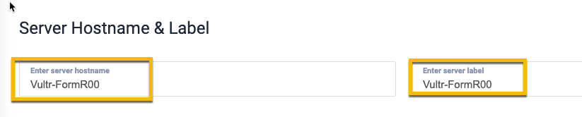
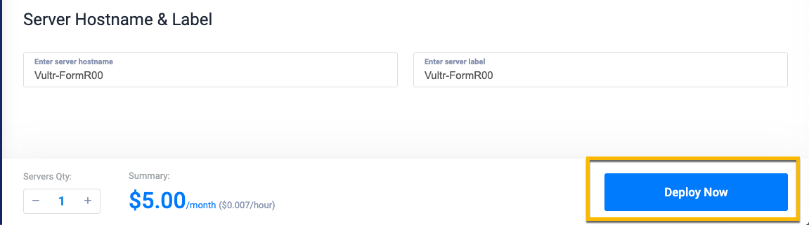
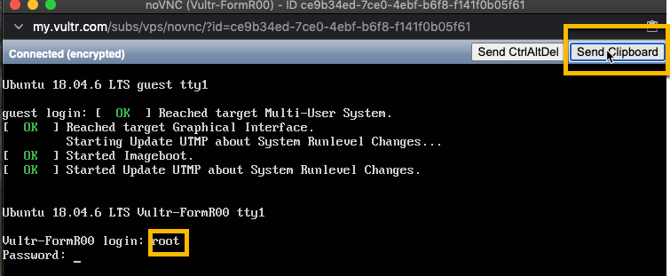

<!-- ------------------------------------------------------------------------- -->

<div class="page-back">

[BACK - Clone FormR  ](/Setup/fr0103_Clone-FormR.md)
</div><div class="page-next">

[Harden Ubuntu - NEXT](/Setup/fr0302_Setup-Hardening-Ubuntu.md)
</div><div style="margin-top:35px">&nbsp;</div>

<!-- ------------------------------------------------------------------------- -->

## 2.1 Create Vultr Ubuntu (<20 mins)
#### [Purpose and Background](../Setup/purposes/pfr0301_Setup-Vultr-Ubuntu.md)

#### Introduction
- In order to test our FormR apps on the Internet  we will create an Ubuntu server on the cloud provider, Vultr.com. 
- Vultr costs only $5 per month. Once you complete your secure website you can

#### Important note about names, capitalization and pictures
- In this tutorial please be careful to use the Exact Spelling and Capitalization. You will be using Windows, Unix and GitBash command prompts. Improper captialization will cause commands to fail. Some examples are: Local_Admin, myProject, repos, remotes and .ssh.
- This documentation was produced during 2021. You will experience differences in some of the pictures due to the changes made over time by the developers of the softwares and web sites that are used.


----
### 1. Create New Ubuntu Instance  (<10 mins)
----
1. Signin or create an account on vultr.com (Note the ref=8778592 below tells Vultr and us that you are doing the FormR tutorial.)

- Browse to:

```
https://www.vultr.com/?ref=8778592
```

2. Deploy New Server 


3. Choose Server: Cloud Compute


4. Server Location


5. Server Type: Ubuntu 18.04 x64 (We use this version for the FormR tutorial. If this version is not available in the future, then choose the lowest version, since it is the most tested.)


6. Server Size: 25GB SSD


7. Add SSH Key
    - Select your Vultr public key in C:\users\Local_Admin\\.ssh


    - Open the file in Notepad and copy the key 


    - Paste the key value into the Vultr SSH Key box and give the key a name.


8. Server Host Name and Label: Vultr-FormR0 for both




9. Click Deploy Now



- Installing


----
### 2. Open Vultr VM Console to Log in (<10 mins)
----
1. Click on Products, then the Server Name i.e. Vultr-FormR0


2. Click the copy password icon


```
#### !! Remember to write your passwords in a safe place !!
```

3. Click the View Console icon


4. Click in the console window and then enter login: root and press enter

5. Click the Send clipboard button and press enter.




6. You will see the Welcome screen for Ubuntu and the command prompt:

    root@Vultr-FormR0:~#


----
#### Congratulations! You have created your Ubuntu server on Vultr.
----


<!-- ------------------------------------------------------------------------- -->

<div class="page-back">

[BACK - Clone FormR  ](/Setup/fr0103_Clone-FormR.md)
</div><div class="page-next">

[Harden Ubuntu - NEXT](/Setup/fr0302_Setup-Hardening-Ubuntu.md)
</div>


