<!-- ------------------------------------------------------------------------- -->

<div class="page-back">

[BACK - Setup-Vultr-Ubuntu](/Setup/fr0301_Setup-Vultr-Ubuntu.md)
</div><div class="page-next">

[Install Web Server - NEXT](/Setup/fr0303_Setup-Web-Server-Ubuntu.md)
</div><div style="margin-top:35px">&nbsp;</div>

<!-- ------------------------------------------------------------------------- -->

## Instructions for Hardening the Ubuntu server.

- IMPORTANT:  Copy the code lines from the documentation, then click the Send Clipboard button to paste to the console.

- Tip: To clear the console at the console prompt enter: clear

### 1. Restart your Vultr VM and Login

1. Login the your Vultr FormR1 console and click the Restart button


2. From your Vultr FormR1 console
 
3. Copy the root password
 
4. Click View Console button
 


5. Login as root using the Send Clipboard button


### 2. Create a new sudo user

1. Create a new user alias with root privileges. This user will login remotely.

```
useradd -ou 0 -g 0 -d /root -s /bin/bash -G sudo nimda
```


2. Add the nimda password: FormR!1234

```
passwd nimda

FormR!1234
```

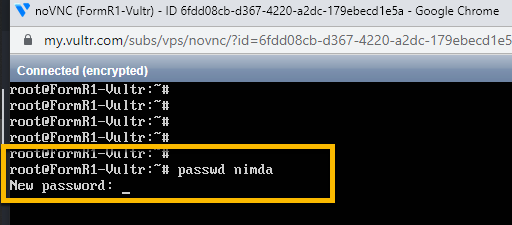


3. Check to see if nimda is in sudo group

```
grep '^sudo' /etc/group
```

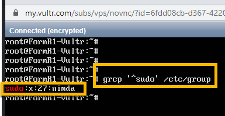

4. Check user info

```
cat /etc/passwd
```

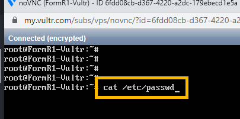


### 3. Update and upgrade server

1. Enter Y when asked by the following:

```
apt-get update && apt-get upgrade
```

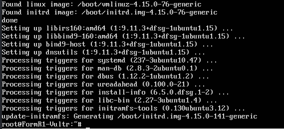

### 4. Install and Configure unattended-updates

1. Install
```
apt-get install unattended-upgrades
```

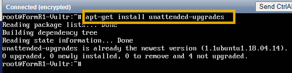

2. Check installation
```
systemctl status unattended-upgrades
```

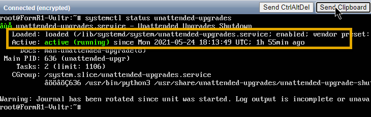

3. Using the nano editor, modify apt.conf.d/50unattended-upgrades

```
nano /etc/apt/apt.conf.d/50unattended-upgrades
```

4. Uncomment the “updates” line by deleting the two slashes at the beginning of it:

```
"${distro_id}:${distro_codename}-updates";
```

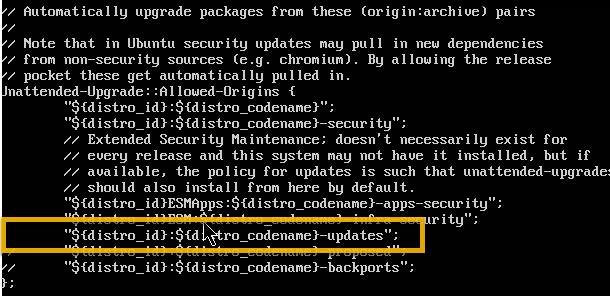

5.  Uncomment and modify:

```
Unattended-Upgrade::Remove-Unused-Kernel-Packages "true";
Unattended-Upgrade::Remove-Unused-Dependencies "true";
Unattended-Upgrade::Automatic-Reboot "true";
Unattended-Upgrade::Automatic-Reboot-Time "02:38";
```

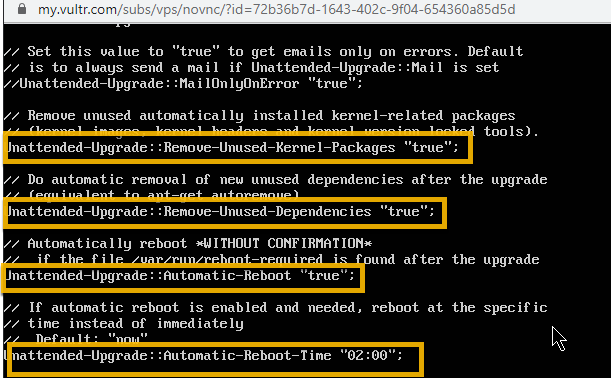

6. Save the file by pressing Ctrl-X, then Y and then Enter to save the file name.

7. Using nano, enable Automatic Updates

```
nano /etc/apt/apt.conf.d/20auto-upgrades
```

8. Add these lines:
```
APT::Periodic::Update-Package-Lists "1";
APT::Periodic::Download-Upgradeable-Packages "1";
APT::Periodic::AutocleanInterval "7";
APT::Periodic::Unattended-Upgrade "1";
```

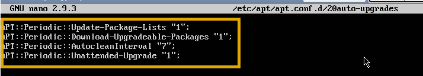

9. Save the file by pressing Ctrl-X, then Y and then Enter to save the file name.

10. Check if Unattended Upgrades works

```
unattended-upgrades --dry-run --debug
```

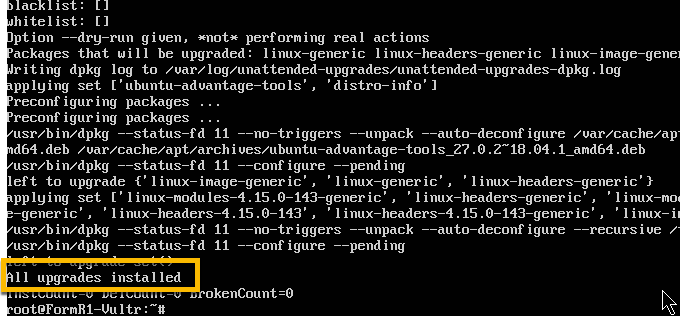

11. Reboot the server

```
From the console prompt enter:

clear
reboot (or you can Click the Send CtrlAltDel button)

After reboot login again as root, copy the password from the Vultr and click the Send Clipboard button
```

### 5. Secure Shared Memory

1. Edit  fstab

```
nano /etc/fstab
```

2. Add the following line to the bottom of that file:

```
tmpfs /run/shm tmpfs defaults,noexec,nosuid 0 0  
``` 


3. Save the file by pressing Ctrl-X, then Y and then Enter to save the file name.

4. Reboot the server

```
From the console prompt enter:

clear

reboot  (or you can Click the Send CtrlAltDel button)

After reboot login again as root, copy the password from the Vultr and click the Send Clipboard button
```

### 6. Enable SSH Login for Specific Users Only

1. Get your IP address at:

```
https://whatismyipaddress.com/
``` 


 
2. Edit sshd_config

```
nano /etc/ssh/sshd_config
```

3. At the bottom of the file, add the line: (Use your own workstation's IP address. 


```
AllowUsers nimda@xxx.xxx.xxx.xxx
```

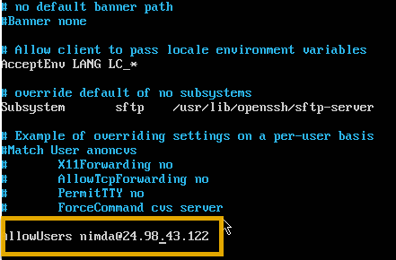

4. Save the file by pressing Ctrl-X, then Y and then Enter to save the file name.

5. Restart sshd with this command:

```
systemctl restart sshd
```

#### - Test local access to your Vultr FormR VM. 

6. Get the VM IP address from your Vultr FormR1 console i.e 45.76.252.191

7. Open the Windows command prompt on your Develper Workstation

8. Paste the following:

```
ssh nimda@<your VM IP address>
```

9. Enter the password: FormR!1234

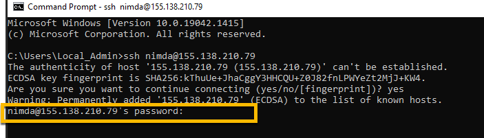

### 7. Include a Security Login Banner

1. Create a banner file

```
nano /etc/issue.net
```

2. - Add a warning message

```
************************************************************************

 Warning!!! This server is dedicated for FormR purposes.
     
 Malicious users will be subject to civil and/or criminal prosecution.
     
************************************************************************
```

3. Save the file by pressing Ctrl-X, then Y and then Enter to save the file name.

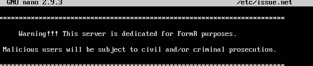

4. Disable the banner message from Message Of The Day (motd).

```
nano /etc/pam.d/sshd
```

5. Comment out the following two lines (adding a # to the beginning of each line):

```
#session optional pam_motd.so motd=run/motd.dynamic
#session optional pam_motd.so noupdate
```

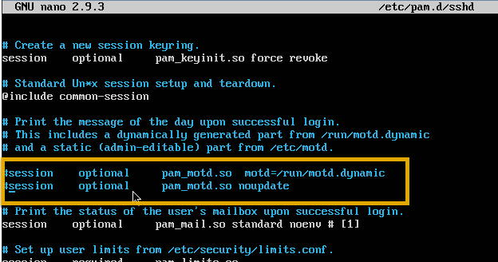
     
6. Save the file by pressing Ctrl-X, then Y and then Enter to save the file name.

7. Edit sshd_config

```
nano /etc/ssh/sshd_config
```

8. Replace

```
#Banner none   with    

Banner  /etc/issue.net
```

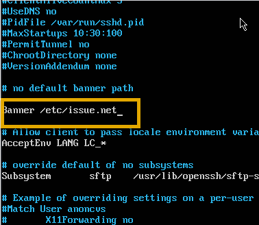

9. Save the file by pressing Ctrl-X, then Y and then Enter to save the file name.

10. Restart the sshd service
     
```
systemctl restart sshd
```

11. When someone logs into your server using SSH, they see your newly added banner warning them of any consequences of further action. 

### 8. Fail2ban

1. Install (Enter Y or y when asked to continue.)

```
apt-get install fail2ban
```

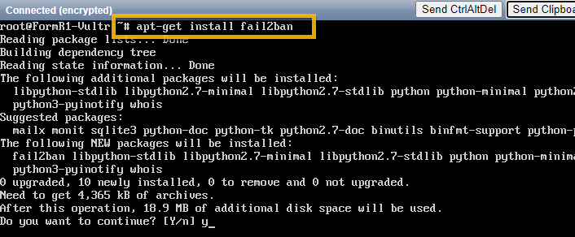

2. Configure Fail2Ban

```     
nano /etc/fail2ban/jail.local
```

3. In this new file, add the following contents:

```
[sshd]
enabled = true
port = 22
filter = sshd
logpath = /var/log/auth.log
maxretry = 3
```

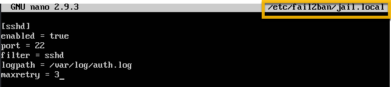

4. This configuration enables the jail, sets the SSH port to be monitored to 22, uses the sshd filter, sets the max login tries, and sets the log file to be monitored.

5. Save the file by pressing Ctrl-X, then Y and then Enter to save the file name.

6. Restart fail2ban with the command:

```
systemctl restart fail2ban
```

7. Attempts to login to the server and fail the three times, access is blocked from the IP address. 

### 9. Enable firewall

1. Allow ssh connections through firewall

```
ufw allow OpenSSH
```

2. Enable firewall

```
ufw --force enable
```

3. Check firewall status

```
ufw status
```

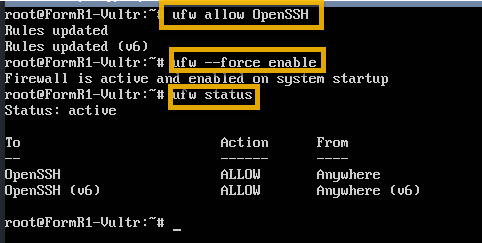

### 10. Set the server time zone

1. Enter into the cpnsole:

```
timedatectl set-timezone America/New_York 
```

2. Check TimeZone

```
timedatectl
```

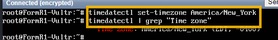

### 11. Test local access after Hardening

1. Test local access to your Vultr FormR VM. 

2. Get the VM IP address from your Vultr FormR1 console i.e 45.76.252.191

3. Open the Windows command prompt on your Develper Workstation

4. Paste the following:

```
ssh nimda@<your VM IP address>
```


### 12. Create Snapshot of server in Vultr 

(Note: Snapshots can take up to 20 minutes to complete)

1. From Vultr console select snapshots

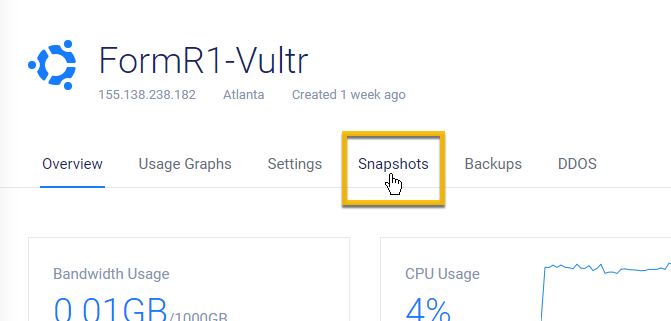

2. Add a label, take snapshot

```
FormR-Hardened-Server
```

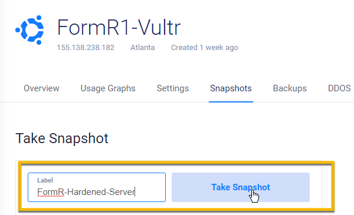

3. List Snapshots

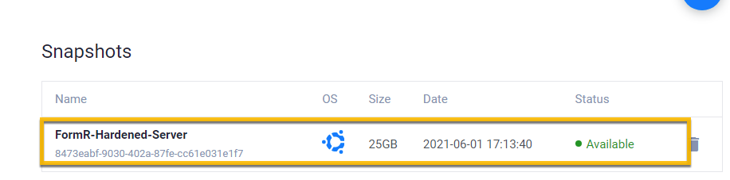

----
### Congratulations! You have hardened your Ubuntu server on Vultr.
----


<!-- ------------------------------------------------------------------------- -->

<div class="page-back">

[BACK - Setup-Vultr-Ubuntu](/Setup/fr0301_Setup-Vultr-Ubuntu.md)
</div><div class="page-next">

[Install Web Server - NEXT](/Setip/fr0303_Setup-Web-Server-Ubuntu.md)
</div>

<!-- ------------------------------------------------------------------------- -->

