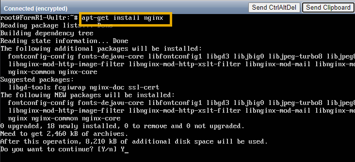
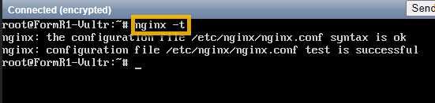
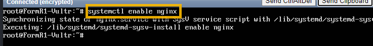
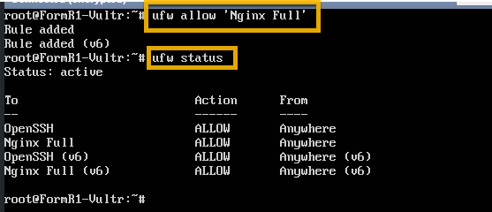
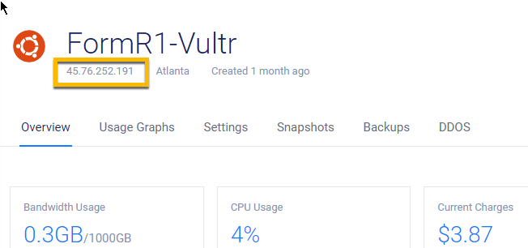
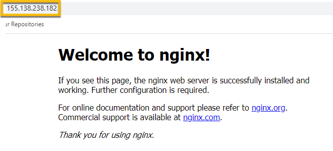
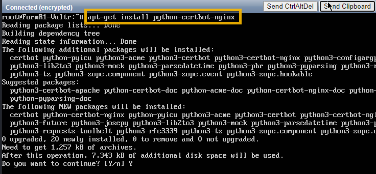
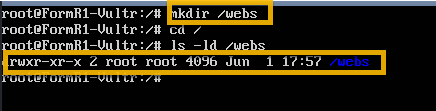
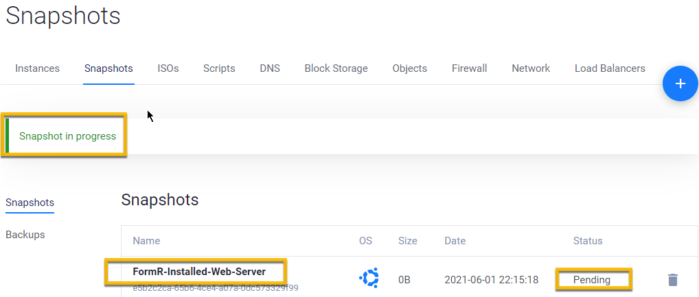

<!-- ------------------------------------------------------------------------- -->

<div class="page-back">

[BACK - Harden Ubuntu     ](/Setup/fr0302_Setup-Hardening-Ubuntu.md)
</div><div class="page-next">

[Install App Server - NEXT](/Setup/fr0304_Setup-App-Server-Ubuntu.md)
</div>

<!-- ------------------------------------------------------------------------- -->

## Setup Instructions for the web server, NGINX, on Ubuntu

 ### 0. Restart your Vultr VM and Login

 - Login the your Vultr FormR1 console and click the Restart button


 - From your Vultr FormR1 console
 - Copy the root password
 - Click View Console button
 


Login as root using the Send Clipboard button


### 1. Install nginx
- Install
```
apt-get install nginx
```



- Check
```
nginx -t
```



- Enable nginx to auto start
```
systemctl enable nginx
```



- Allow http & https through firewall
```
ufw allow 'Nginx Full'
```



- Test the default web site by IP. 

- Get the server IP from Vultr



- Browse to your server's IP address.

```
http://xxx.xxx.xxx.xxx
```



### 2. Install Certbot

Certbot is used to create SSL certificates using LetsEncrypt.

```
apt-get install python-certbot-nginx
```




### 3. Create webs directory

- Create a directory to hold your applications.
```
mkdir /webs
```

- Check that /webs directory was created
```
cd /
ls -ld /webs
```



### 4. Create Snapshot of server in Vultr
```
Use label: FormR-Installed-Web-Server
```



<!-- ------------------------------------------------------------------------- -->

<div class="page-back">

[BACK - Harden Ubuntu     ](/Setup/fr0302_Setup-Hardening-Ubuntu.md)
</div><div class="page-next">

[Install App Server - NEXT](/Setup/fr0304_Setup-App-Server-Ubuntu.md)
</div>

<!-- ------------------------------------------------------------------------- -->

