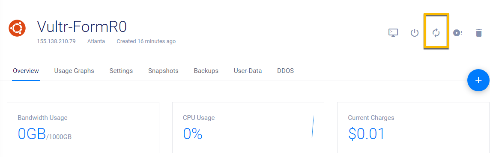
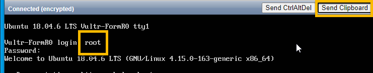

<!-- ------------------------------------------------------------------------- -->

<div class="page-back">

[BACK - Harden Ubuntu     ](/Setup/fr0302_Setup-Hardening-Ubuntu.md)
</div><div class="page-next">

[Install App Server - NEXT](/Setup/fr0304_Setup-App-Server-Ubuntu.md)
</div><div style="margin-top:35px">&nbsp;</div>

<!-- ------------------------------------------------------------------------- -->

## Setup Instructions for the web server, NGINX, on Ubuntu

 ### 1. Restart your Vultr VM and Login

 1. Login the your Vultr FormR1 console and click the Restart button



 2. From your Vultr FormR1 console
 
 3. Copy the root password
 
 4. Click View Console button
 


5. Login as root using the Send Clipboard button



### 2. Install nginx

1. Install

```
apt-get install nginx
```


2. Check
```
nginx -t
```


3. Enable nginx to auto start

```
systemctl enable nginx
```


4. Allow http & https through firewall
```
ufw allow 'Nginx Full'
```


5. Test the default web site by IP. 

6. Get the server IP from Vultr


7. Browse to your server's IP address.

```
http://xxx.xxx.xxx.xxx
```


### 3. Install Certbot

1. Certbot is used to create SSL certificates using LetsEncrypt. Install:

```
apt-get install python-certbot-nginx
```


### 4. Create webs directory

1. Create a directory to hold your applications.

```
mkdir /webs
```

2. Check that /webs directory was created

```
cd /
ls -ld /webs
```


### 5. Create Snapshot of server in Vultr

1. Use label: FormR-Installed-Web-Server


----
### Congratulations! You have installed a Web server on your Ubuntu server.
----

<!-- ------------------------------------------------------------------------- -->

<div class="page-back">

[BACK - Harden Ubuntu     ](/Setup/fr0302_Setup-Hardening-Ubuntu.md)
</div><div class="page-next">

[Install App Server - NEXT](/Setup/fr0304_Setup-App-Server-Ubuntu.md)
</div>

<!-- ------------------------------------------------------------------------- -->

