<!-- ------------------------------------------------------------------------- -->

<div class="page-back">

[BACK - Install Web Server     ](/Setup/fr0303_Setup-Web-Server-Ubuntu.md)
</div><div class="page-next">

[Install Database Server - NEXT](/Setup/fr0305_Setup-Data-Server-Ubuntu.md)
</div><div style="margin-top:35px">&nbsp;</div>

<!-- ------------------------------------------------------------------------- -->


## 2.4 Setup Instructions for application server, NodeJS, on Ubuntu [](../Setup/purposes/pfr0101_Setup-Developer-Workstation.md)


----
### 1. Restart your Vultr VM and Login
----
1. Login the your Vultr FormR1 console and click the Restart button

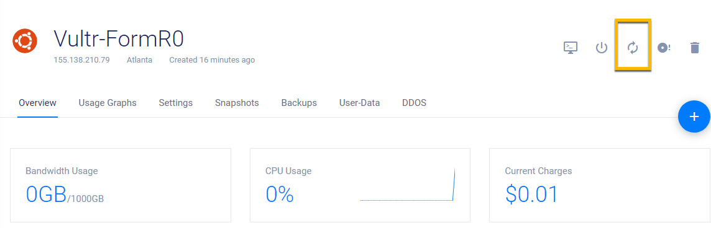

2. From your Vultr FormR1 console
 
3. Copy the root password
 
4. Click View Console button
 
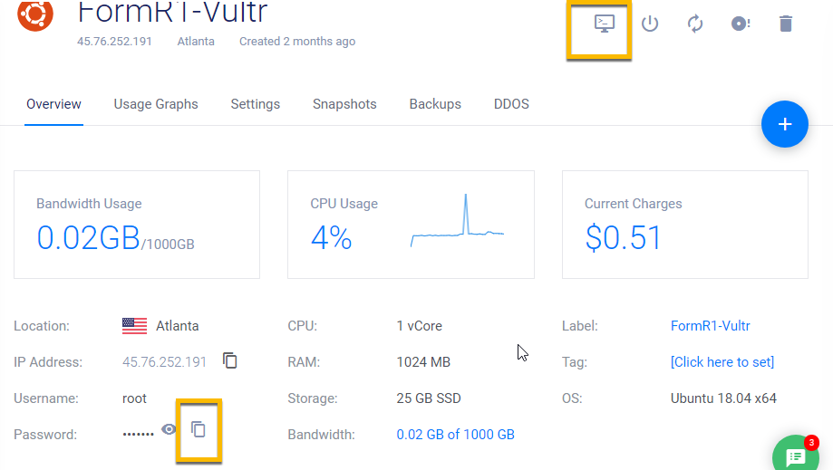

5. Login as root using the Send Clipboard button

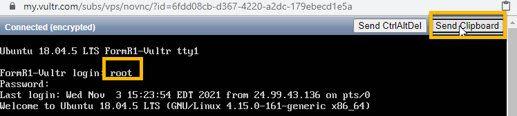

----
### 2. Install nodejs
----

1. Install
```
apt-get install nodejs
```

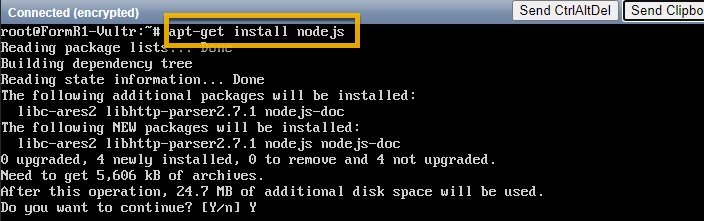

2. Check
```
nodejs --version
```


----
### 3. Install npm
----

1. Install
```
apt-get install npm
```

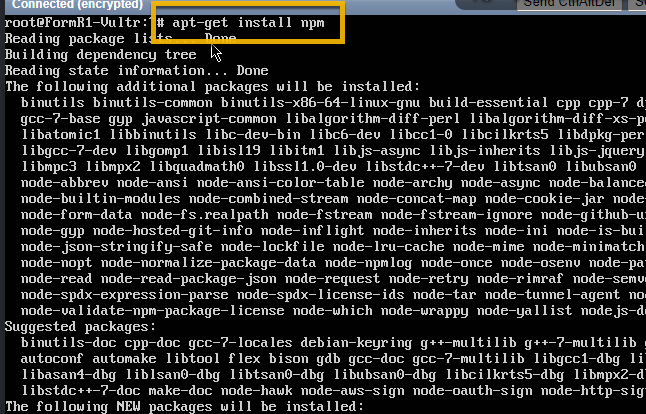

2. Check
```
npm --version
```

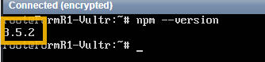

----
### 4. Install  pm2
----

1. Install
```
npm install -g pm2
```

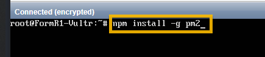

2. Check
```
ps -aux | egrep 'pm2'
```

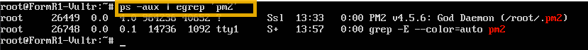

3. Configure pm2 to start automatically on system startup
```
pm2 startup systemd
```

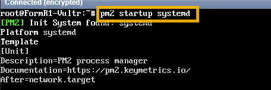

----
### 5. Install Docsify
----

1. Install

```
 npm install docsify -g
```

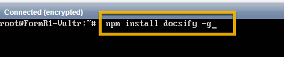

2. Check

```
ps -aux | egrep 'docsify'
```

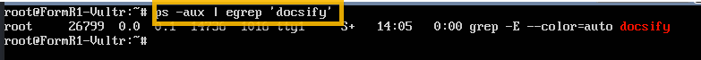

----
### 6. Install Express
----

1. Install 

```
cd /webs
npm init

Select all defaults by pressing enter,
then enter Y for "Is this ok?"
```

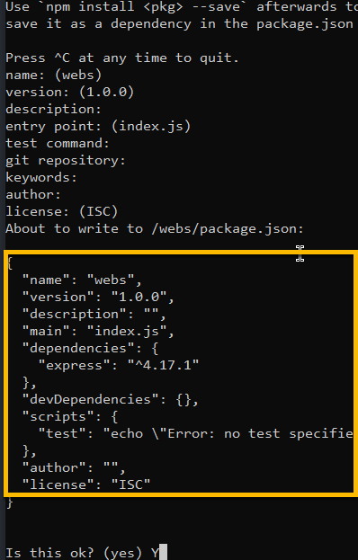

```
npm install express
```

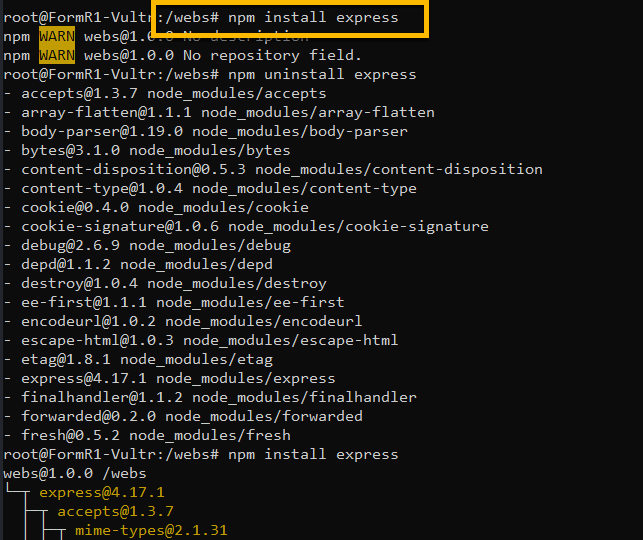


----
### Congratulations! You have installed an Application server on your Ubuntu server.
----

<!-- ------------------------------------------------------------------------- -->

<div class="page-back">

[BACK - Install Web Server     ](/Setup/fr0303_Setup-Web-Server-Ubuntu.md)
</div><div class="page-next">

[Install Database Server - NEXT](/Setup/fr0305_Setup-Data-Server-Ubuntu.md)
</div>

<!-- ------------------------------------------------------------------------- -->

