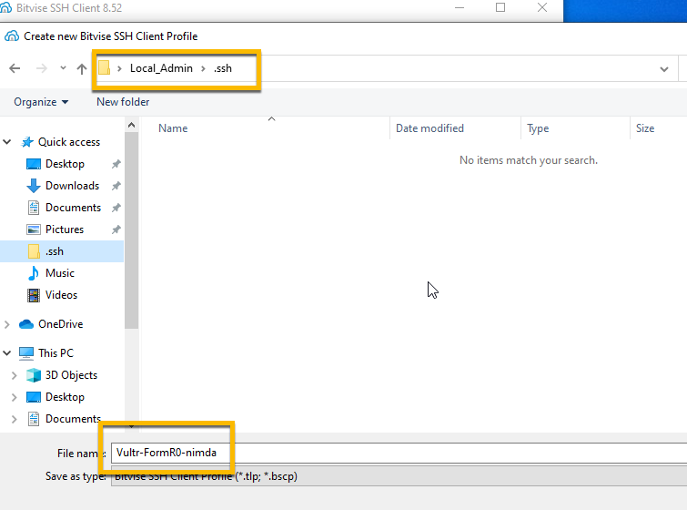
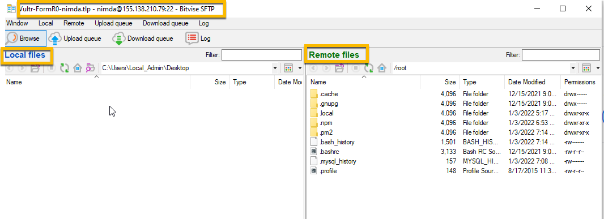
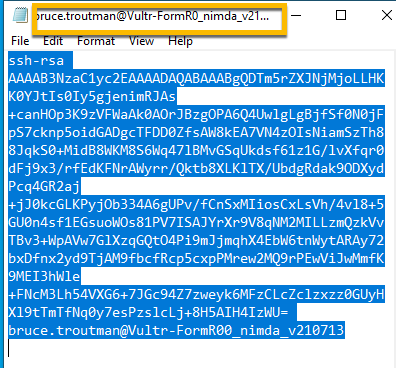
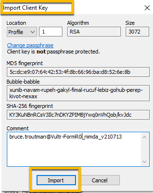
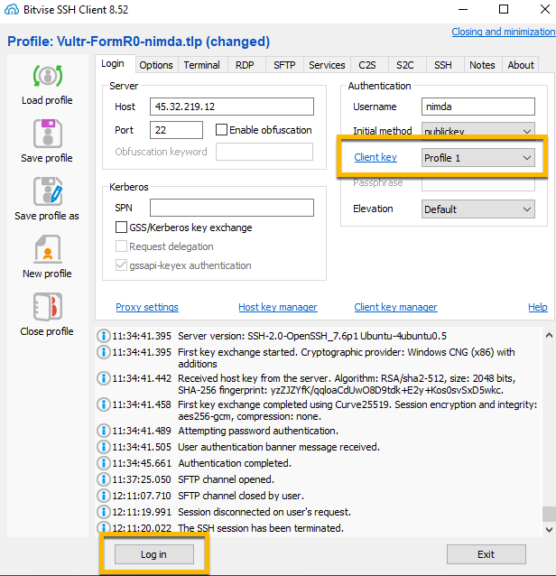

<!-- ------------------------------------------------------------------------- -->

<div class="page-back">

[BACK - Install Data Server](/Setup/fr0305_Setup-Data-Server-Ubuntu.md)
</div><div class="page-next">

[First React Apps - NEXT](/Setup/fr0307_Setup-React-Apps-Ubuntu.md)
</div>
<div style="margin-top:35px">&nbsp;</div>
<!-- ------------------------------------------------------------------------- -->

## 2.6 Website SSL (<1 hr 35 mins)
#### [Purpose and Background](../Setup/purposes/pfr0306_Setup-Website-SSL-Ubuntu.md)

#### Introduction


#### Important note about names, capitalization and pictures
- In this tutorial please be careful to use the Exact Spelling and Capitalization. You will be using Windows, Unix and GitBash command prompts. Improper captialization will cause commands to fail. Some examples are: Local_Admin, myProject, repos, remotes and .ssh.
- This documentation was produced during 2021. You will experience differences in some of the pictures due to the changes made over time by the developers of the softwares and web sites that are used.

----
### 1. Use Bitvise securely. Open Bitvise on your local workstation and login as nimda to the Ubuntu server (<5 mins)
----
1. Open Bitvise Client app 

 

2. Click New Profile
 


3. Navigate to the Local_Admin\.shh folder and enter new profile name: 

```
Vultr-FormR0-nimda
```




4. Enter:

```
  Host IP address: Your Vultr Ubuntu server IP 
```

 

5. then enter:

```
  Port: 22
  Username: nimda
  Initial Method: password
  Check the box: "Store encrypted password in profile
  Password: FormR!1234
```

#### !! Remember to write your passwords in a safe place !!


  
6. Click log In (You will see Host Key, Warning message and then be logged in via password)

- Host key - Click Accept and Save (This will only happen on the first logon.)


- Warning Banner - Click the X to close it


- Authenticated Completion 


7. Click Save profile icon


- Select - Any account on this computer - and click OK


8.  Close Bitvise by clicking X in upper right corner


----
### 2. Configure Login via Public Key (SSH keys are more secure than passwords) (<15 mins)
----
1. Open Bitvise, the profile, Vultr-FormR0-nimda, should load. 
- Click Log in, then 
- Warning Banner - Click the X to close it


- Click New SFTP window icon




2. Click in Remote files pane (right) and enter: /root

3. Right click in blank space and click Create Folder, then enter: .ssh


4. navigate to folder /root/.ssh and create file: authorized_keys


 

5. In Local files panes (left)
6. Navigate to C:/users/Local_Admin/.ssh and edit the public key (.pub) file for Vultr_FormR0_nimda
7. Right click and select Edit

    (Note you may need to expand the name column to see the .pub extension)

 

8. Copy the one line of text. e.g.
    ssh-rsa AAAAB3NzaC1yc2...brucetroutman_v210511

  


9. In the Remote Files pane (right)
10. Edit the file /root/.ssh/authorized_keys

 

11. Paste the public key text and Save


12. close SFTP window

13. From the Profile window
14. Logout 
15. Change Authentication, Initial method from 'password' to 'public key' and 
16. Click the Client Key Manager link in the middle of the form, then 
17. Click Import


18. Navigate to Local-Admin/.ssh folder
19. Select 'All files' in the Bitvise Keypair drop down then 
20. Select the Private key file that matched the previously used Public key then 
21. Click Open
22. Click Import in the Import Client Key window


23. Click Import in the Import Client Key window



24. Click to close Client Key Manager


25. Select the just imported key (Profile 1) from the Client key drop down and 
26. Click Login (You will be logged in via public key)



#### IMPORTANT -- Click Save Profile !!!
</br>


- Select - Any account on this computer - and click OK


----
### 3. Using Bitvise New Terminal console delete nginx default files (<5 mins)
----
1. Open New Terminal console


```
unlink /etc/nginx/sites-available/default

unlink /etc/nginx/sites-enabled/default
```


----
### 4. Using Bitvise New Terminal console Clone simpleApp using git (<5 mins)
----

1. Open New Terminal console

```
cd /webs 

git clone https://github.com/8020Data/simpleApp.git simpleApp
```

-  Confim clone

```
cd simpleApp
ls -l
```
2. Open port 5000 through the firewall
```
ufw allow 5000
```


3. Install and start app.js on the server

```
npm install

node app.js
```


4. Use your local browser to test your server
5. Get your IP address from the Bitvise console


```
<your server ip address here>:5000
```


----
### 5. Setup pm2 to run website automatically (<5 mins)
----
1. Go to the Bitvise New terminal console
2. Navigate to 

```
cd /webs/simpleApp
```

3. Start app.js

```
pm2 start app.js 
```


4. Allow pm2 to start on boot up

```
pm2 startup systemd
```


5. Save pm2 configuration, then Reboot

```
pm2 save --force

reboot
```


6. Wait a few minutes for server to reboot then test from local browser, 

```
<your server ip address here>:5000
```


----
### 6. Setup nginx proxy (<5 mins)
----

1. Go to the Bitvise New terminal console

- Copy simpleApp.conf file

```
cp /webs/simpleApp/etc/nginx/sites-available/simpleApp.conf /etc/nginx/sites-available/simpleApp.conf
```

2. Create symbolic link to /etc/nginx/sites-enabled

```
ln -s /etc/nginx/sites-available/simpleApp.conf /etc/nginx/sites-enabled/simpleApp.conf
```


3. Test and Reload nginx
```
nginx -t
```

```
systemctl reload nginx
```


----
### 7. Create a domain for public access to your server (<15 mins)
----
#### Note: 
- To install a Letsencrypt SSL certificate you will need a Domain Name. Our example creates a domain at GoDaddy.com.

- There are many domain providers. You can expect to pay about $19/yr. Often there are sales promotions. Also all of them offer many extra services. --- In our FormR example we decline all extra services from the domain provider. 

- The GoDaddy web site changes frequently, so the screen shots below may not match. The steps are repeatable. Contact GoDaddy support for more assistance.
----
1. Create a new Domain Name e.g. formr-cbt-00.com at GoDaddy.com. (cbt = my initials. Use yours or something else that is unique)

2. Browse to

```
godaddy.com 
```

3. Enter domain name

```
formr-<your initiatls>-00.com

e.g. formr-cbt-00.com
```


4. Follow the instructions to use or create your account and place your order


 

 

----
### 8. Update your DNS record to point YourURL to your server IP address. (<10 mins)
----
1. Login to your GoDaddy.com account
2. Click Your Account
3. Click My Products
4. Click YourURL e.g. formr-cbt-00.com


5. Click DNS dropdown
6. Select Manage Zones


7. Enter Your domain e.g. formr-cbt-00.com
8. Click it


9. Click the Edit icon for the A record


10. Change the Points to = Parked to - the IP address of your Vultr server

11. Get your IP address from the Vultr console


12. Change Parked


 
To Your server IP address and Save


13. Wait 10-15 minutes then 
14. Browse to your web site via http

```
http://formr-<yourinitials>-00com

e.g http://formr-cbt-00.com
```


----
### 9. Modify simpleApp.conf to use your new URL (<5 mins)
----
1. Open Bitvise 
2. Load Profile: Vultr-FormR0-nimda.tlp
3. Login
4. From your Bitvise SFTP window navigate to 

```
/etc/nginx/sites-available
```
5. On "simpleApp.conf" right click and select Edit 


6. Change  yourURL  to  formr-yourInitials-00.com


 


7. Save this file

----
### 10. Personalize the FormR Home Page (<5 mins)
----
1. From your Bitvise SFTP window navigate to 

```
/webs/simpleApp/

```
2. On "app.js" right click and select Edit 


3. Add something personal to the "Welcome to" line. e.g. Welcome to Bruce's FormR 


 

4. Save this file then Close the SFTP window

5. Reboot from the Bitvise New terminal console (Bitvise will reconnect when server is back up)

```
reboot
```

6. Browse to your IP e.g. 155.138.210.79:5000

```
http:<your VM IP>:5000
```


7. Close Bitvise by clicking X in upper right corner


----
### 11. Add SSL certificate using Letsencrypt (<5 mins)
----
1. Open Bitvise New Terminal Console and enter (You might use notpad to build yoururl)

```
certbot --nginx -d <yoururl>  

<yoururl> =  formr-<yourinitials>-00.com e.g. formr-cbt-00.com
```
2. Enter A to Accept


3. Enter 2 to Redirect


4. Browse to your web via https

```
https://yoururl

e.g. https://formr-cbt-00.com

```


----
### 12. Disable TLSv1.0 and TLSv1.1 and enable TLSv1.3 protocols (<10 mins)

- This is for improved SSL security
----
1. Edit nginx.conf

```
nano /etc/nginx/nginx.conf
```


2. Modify SSL Settings

- Remove

```
ssl_protocols TLSv1 TLSv1.1 TLSv1.2; # Dropping SSLv3, ref: POODLE
```


- Add

```
ssl_protocols TLSv1.2 TLSv1.3;
```


3. Save the file by pressing Ctrl-X, then Y and then Enter to save the file name.

4. Edit options-ssl-nginx.conf

```
nano /etc/letsencrypt/options-ssl-nginx.conf
```


6. Modify SSL Settings

- Remove

```
ssl_protocols TLSv1 TLSv1.1 TLSv1.2;
```


- Add

```
ssl_protocols TLSv1.2 TLSv1.3;
```


7. Save the file by pressing Ctrl-X, then Y and then Enter to save the file name.

8. Test nginx and reload it

```
nginx -t

service nginx reload
```


9.  Close Bitvise by clicking X in upper right corner


10. Test your SSL settings by browsing to:

```
ssllabs.com/ssltest/
```

- Enter your URL e.g. formr-cbt.00.com


- Your test results


----
#### Email us your test results picture. We would love to hear from you!!
#### 8020data@gmail.com
----
----
### 13. Close Port 5000 (< 5 mins)
----
1. From the Bitvise New terminal console enter:

```
   ufw status numbered 

   ufw delete 8

   ufw delete 4
```


----
#### Congratulations your Ubuntu server is secure and ready for action.
----

<!-- ------------------------------------------------------------------------- -->

<div class="page-back">

[BACK - Install Data Server](/Setup/fr0305_Setup-Data-Server-Ubuntu.md)
</div><div class="page-next">

[First React Apps - NEXT](/Setup/fr0307_Setup-React-Apps-Ubuntu.md)
</div>
<!-- ------------------------------------------------------------------------- -->
