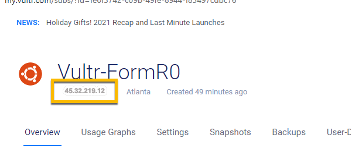
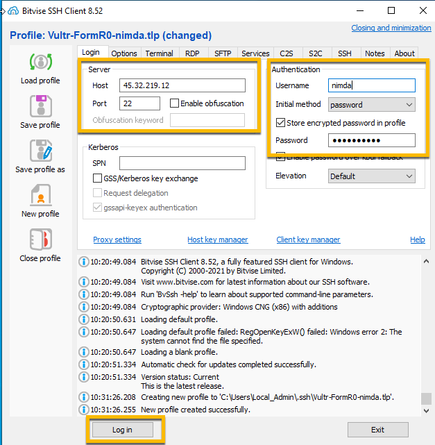
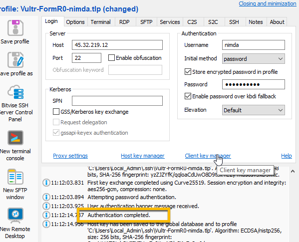
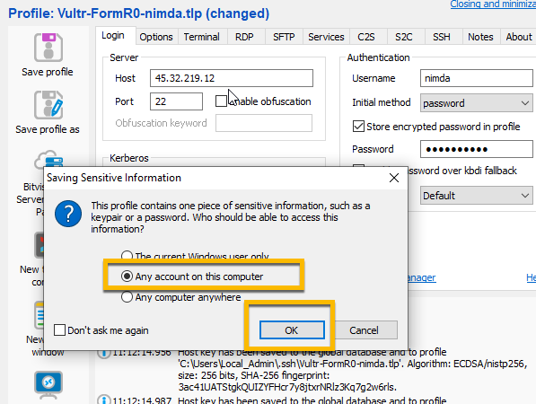
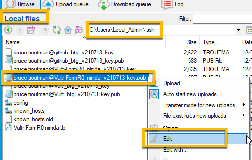
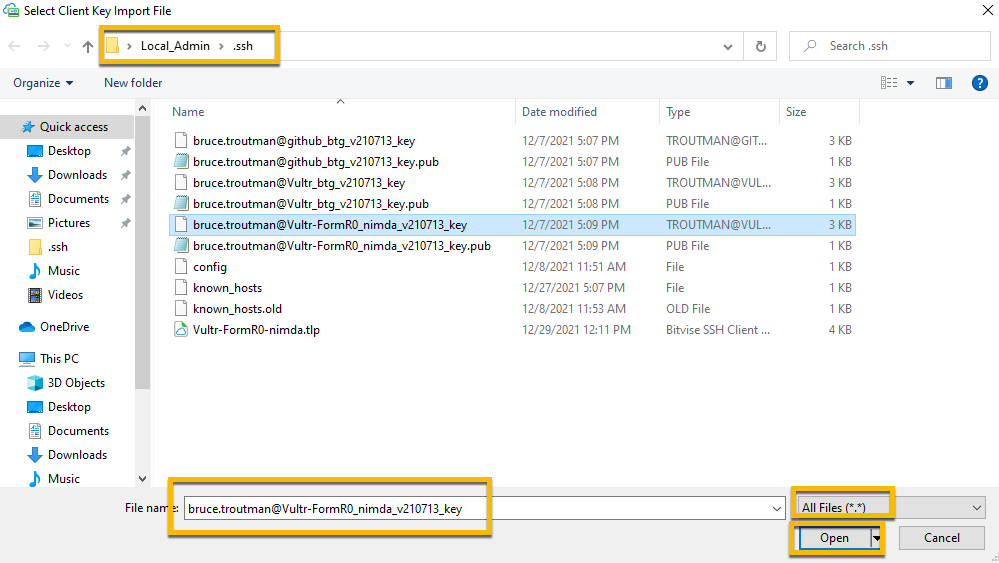

<!-- ------------------------------------------------------------------------- -->

<div class="page-back">

[BACK - Install Database Server](/Setup/fr0305_Setup-Data-Server-Ubuntu.md)
</div><div class="page-next disabled">

NEXT
</div><div style="margin-top:35px">&nbsp;</div>

<!-- ------------------------------------------------------------------------- -->

## Setup Instructions for creating a simple website with SSL

### 1. Use Bitvise securely. Open Bitvise on your local workstation and login as nimda to the Ubuntu server

  1. Open Bitvise Client app 

 

  2. Click New Profile
 


  3. Enter new profile name: 

```
FormR1-Vultr-nimda
```


  4. Enter:

```
  Host IP address: Your Vultr Ubuntu server IP 
```

 

  5. then enter:

```
  Port: 22
  Username: nimda
  Initial Method: password
  Password: FormR!1234
```

```
#### !! Remember to write your passwords in a safe place !!
```

  
  6. Click log In (You will see Warning message and then be logged in via password)





  7. Click Save profile icon and save as FormR1-Vultr-nimda




### 2. Configure Login via Public Key (SSH keys are more secure than passwords)

  1. Open Bitvise profile, Formr-Vultr-nimda, click Log in, then click New SFTP window icon


    2. Right click in remote files pane (right)

    - create folder: /root/.ssh


    - navigate to folder /root/.ssh and create file: authorized_keys


 

    3. In local files panes (left)
    - Navigate to C:/users/Local_Admin/.ssh and edit the public key (.pub) file for FormR_Vultr_nimda

    - Right click and select Edit

    (Note you may need to expand the name column to see the .pub extension)

 

    - Copy the one line of text. e.g.
    ssh-rsa AAAAB3NzaC1yc2...brucetroutman_v210511

  


    4. In the Remote Files pane (right)
      - Edit the file /root/.ssh/authorized_keys

 

      - Paste the public key text and Save


      - close SFTP window

    5. From the Profile window
    - Logout 
    - Change Authentication, Initial method from 'password' to 'public key' and 
    - Click the Client Key Manager link in the middle of the form, then 
    - Click Import


    - Navigate to Local-Admin/.ssh folder
    - Select 'All files' in the Bitvise Keypair drop down then 
    - Select the Private key file that matched the previously used Public key then 
    - Click Open
    - Click Import in the Import Client Key window



    - Click Import in the Import Client Key window


    - Click to close Client Key Manager


    - Select the just imported key (Profile 1) from the Client key drop down and 
    - Click Login (You will be logged in via public key)


#### IMPORTANT -- Click Save Profile !!!


### 3. Using Bitvice New Terminal console delete nginx default files 

  1. Open New Terminal console


```
unlink /etc/nginx/sites-available/default

unlink /etc/nginx/sites-enabled/default
```


### 4. Clone simpleApp using git 
```
cd /webs
git clone https://github.com/8020data/simpleApp.git simpleApp
```
  1. Confim clone
```
cd simpleApp
ls -l
```
  2. Open port 5000 through the firewall
```
ufw allow 5000
```


  3. Start app.js on the server
```
node app.js
```


  4. Use your local browser to test your server
  5. Get your IP address from the Bitvise console


```
<your server ip address here>:5000
```


### 5. Setup pm2 to run website automatically

  1. Go to the Bitvise Terminal console
  2. Navigate to 

```
cd /webs/simpleApp
```

  3. Start app.js

```
pm2 start app.js 
```


  4. Allow pm2 to start on boot up

```
pm2 startup systemd
```


  5. Save pm2 configuration, then Reboot

```
pm2 save --force

reboot
```


  6. Test from local browser, 

```
<your server ip address here>:5000
```


### 6. Setup nginx proxy 

  1. Copy simpleApp.conf file

```
cp /webs/simpleApp/etc/nginx/sites-available/simpleApp.conf /etc/nginx/sites-available/simpleApp.conf
```

  2. Create symbolic link to /etc/nginx/sites-enabled

```
ln -s /etc/nginx/sites-available/simpleApp.conf /etc/nginx/sites-enabled/simpleApp.conf
```


  3. Test and Reload nginx
```
nginx -t
```

```
systemctl reload nginx
```


### 7. Create a domain for public access to your server (Skip to step 11, if you don't wan't to purchase a domain.) 

#### Note: To install a Letsencrypt SSL certificate you will need a Domain Name. Our example creates a domain at GoDaddy.com.

####    There are many domain providers. You can expect to pay about $19/yr. Often there are sales promotions. Also all of them offer many extra services.

#### ***In our example we decline all extra services.*** 
#### (Note that the GoDaddy web site changes frequently, so the screen shots below may not match. The steps are repeatable. Contact GoDaddy support for more assistance.)
 
  1. Create a new Domain Name e.g. formr-cbt-00.com at GoDaddy.com. (cbt = my initials. Use yours or something else that is unique)

  2. Browse to

```
godaddy.com 
```

  3. Enter domain name

```
formr-<your initiatls>-00.com

e.g. formr-cbt-00.com
```


  4. Follow the instructions to use or create your account and place your order


 

 


### 8. Update your DNS record to point YourURL to your server IP address.

  1. Login to your GoDaddy.com account
  2. Click Your Account
  3. Click My Products
  4. Click YourURL e.g. formr-cbt-00.com


  5. Click DNS dropdown
  6. Select Manage Zones


  7. Enter Your domain e.g. formr-cbt-00.com
  8. Click it


  9. Click the Edit icon for the A record


  10. Change the Points to = Parked to - the IP address of your Vultr server

  11. Get your IP address from the Bitvise console


  12. Change Parked


 
To Your server IP address and Save


  13. Wait 10-15 minutes then 
  14. Browse to your web site via http

```
http://formr-<yourinitials>-00com

e.g http://formr-cbt-00.com
```
@@@@@@ 01 pic 00


### 9. Modify simpleApp.conf to use your new URL

  1. Open Bitvise 
  2. Load Profile: FormR1-Vultr-nimda.tlp
  3. Login
  4. From your Bitvise SFTP window navigate to 

```
/etc/nginx/sites-available/simpleApp.conf

```
  5. Click Edit 


  6. Change  yourURL  to  formr-yourInitials-00.com


 


  7. Save this file then Close the SFTP window

### 10. Add SSL certificate using Letsencrypt

  1. From your Bitvice New Terminal Console enter (You might use notpad to build yoururl)

```
certbot --nginx -d <yoururl>  

yoururl =  formr-<yourinitials>-00.com e.g. formr-cbt-00.com
```
  2. Enter A to Accept


  3. Enter 2 to Redirect


  4. Test your SSL certificate by browsing to:

```
ssllabs.com/ssltest/analyze.html?d=<yoururl>

e.g. ssllabs.com/ssltest/analyze.html?d=formr-cbt.01.com
```


  5. Browse to your web via https

```
https://yoururl

e.g. https://formr-cbt-00.com

```


### 11. Close Port 5000

  1. From the Bitvise Terminal Console enter:

```
   ufw status numbered 

   ufw delete 8

   ufw delete 4
```


<h3> Congratulations your Ubuntu server is secure and ready for action. </h3> 

<!-- ------------------------------------------------------------------------- -->

<div class="page-back">

[BACK - Install Database Server](/Setup/fr0305_Setup-Data-Server-Ubuntu.md)
</div><div class="page-next disabled">

NEXT
</div>

<!-- ------------------------------------------------------------------------- -->
